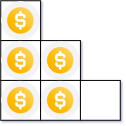
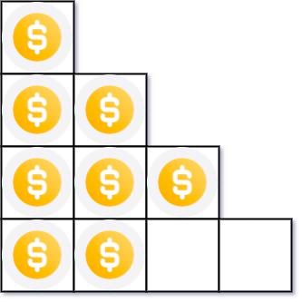

### [441. 排列硬币](https://leetcode.cn/problems/arranging-coins/)
你总共有 n 枚硬币，并计划将它们按阶梯状排列。对于一个由 k 行组成的阶梯，其第 i 行必须正好有 i 枚硬币。阶梯的最后一行 可能 是不完整的。

给你一个数字 n ，计算并返回可形成 完整阶梯行 的总行数。


##### 示例 1：

```
输入：n = 5
输出：2
解释：因为第三行不完整，所以返回 2 。
```

##### 示例 2：

```
输入：n = 8
输出：3
解释：因为第四行不完整，所以返回 3 。
```

##### 提示：
- 1 <= n <= 2<sup>31</sup> - 1

##### 题解：
```rust
impl Solution {
    pub fn arrange_coins(n: i32) -> i32 {
        let n = n as i64;
        let mut lo = 1;
        let mut hi = n;
        let mut ans = -1;

        while lo <= hi {
            let mid = lo + (hi - lo) / 2;

            if (1 + mid) * mid <= n * 2 {
                lo = mid + 1;
                ans = mid;
            } else {
                hi = mid - 1;
            }
        }

        ans as i32
    }
}

```
