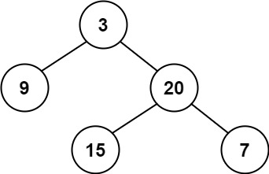
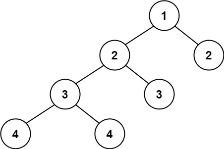

### [110. 平衡二叉树](https://leetcode.cn/problems/balanced-binary-tree/)

给定一个二叉树，判断它是否是高度平衡的二叉树。

本题中，一棵高度平衡二叉树定义为：

一个二叉树每个节点 的左右两个子树的高度差的绝对值不超过 1 。


##### 示例 1：

```
输入：root = [3,9,20,null,null,15,7]
输出：true
```

##### 示例 2：

```
输入：root = [1,2,2,3,3,null,null,4,4]
输出：false
```

##### 示例 3：
```
输入：root = []
输出：true
```

##### 提示：
- 树中的节点数在范围 [0, 5000] 内
- -10<sup>4</sup> <= Node.val <= 10<sup>4</sup>

##### 题解：
```rust
use std::rc::Rc;
use std::cell::RefCell;
impl Solution {
    pub fn is_balanced(root: Option<Rc<RefCell<TreeNode>>>) -> bool {
        Self::get_depth(&root) >= 0
    }

    fn get_depth(root: &Option<Rc<RefCell<TreeNode>>>) -> i32 {
        if let Some(r) = root {
            let depth_left = Self::get_depth(&r.borrow().left);
            let depth_right = Self::get_depth(&r.borrow().right);

            if depth_left == -1 || depth_right == -1 || (depth_left - depth_right).abs() > 1 {
                return -1;
            }

            depth_left.max(depth_right) + 1
        } else {
            0
        }
    }
}
```

`深度优先搜索`
