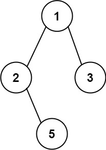

### [257. 二叉树的所有路径](https://leetcode.cn/problems/binary-tree-paths/)
给你一个二叉树的根节点 root ，按 任意顺序 ，返回所有从根节点到叶子节点的路径。

叶子节点 是指没有子节点的节点。


##### 示例 1：

```
输入：root = [1,2,3,null,5]
输出：["1->2->5","1->3"]
```

##### 示例 2：
```
输入：root = [1]
输出：["1"]
```

##### 提示：
- 树中节点的数目在范围 [1, 100] 内
- -100 <= Node.val <= 100

##### 题解：
```rust
use std::rc::Rc;
use std::cell::RefCell;
impl Solution {
    pub fn binary_tree_paths(root: Option<Rc<RefCell<TreeNode>>>) -> Vec<String> {
        let mut ans = Vec::new();
        let mut paths = Vec::new();

        Self::dfs(root, &mut ans, &mut paths);

        ans
    }

    fn dfs(root: Option<Rc<RefCell<TreeNode>>>, ans: &mut Vec<String>, paths: &mut Vec<String>) {
        if let Some(r) = root {
            let mut node = r.borrow_mut();
            let s = node.val.to_string();

            paths.push(s);

            if node.left.is_none() && node.right.is_none() {
                ans.push(paths.join("->"));
            }

            Self::dfs(node.left.take(), ans, paths);
            Self::dfs(node.right.take(), ans, paths);

            paths.pop();
        }
    }
}
```
