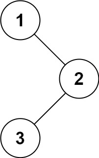

### [144. 二叉树的前序遍历](https://leetcode.cn/problems/binary-tree-preorder-traversal/)
给你二叉树的根节点 root ，返回它节点值的 前序 遍历。


##### 示例 1：

```
输入：root = [1,null,2,3]
输出：[1,2,3]
```

##### 示例 2：
```
输入：root = []
输出：[]
```

##### 示例 3：
```
输入：root = [1]
输出：[1]
```

##### 示例 4：

```
输入：root = [1,2]
输出：[1,2]
```

##### 示例 5：

```
输入：root = [1,null,2]
输出：[1,2]
```

##### 提示：
- 树中节点数目在范围 [0, 100] 内
- -100 <= Node.val <= 100


##### 进阶：
- 递归算法很简单，你可以通过迭代算法完成吗？

##### 题解：
```rust
use std::rc::Rc;
use std::cell::RefCell;
impl Solution {
    pub fn preorder_traversal(root: Option<Rc<RefCell<TreeNode>>>) -> Vec<i32> {
        let mut ans = vec![];
        let mut stack = vec![];
        let mut node = root;

        while node.is_some() || stack.len() > 0 {
            while let Some(n) = node {
                ans.push(n.borrow().val);
                node = n.borrow_mut().left.take();
                stack.push(n);
            }

            if let Some(n) = stack.pop() {
                node = n.borrow_mut().right.take();
            }
        }

        ans
    }
}
```
