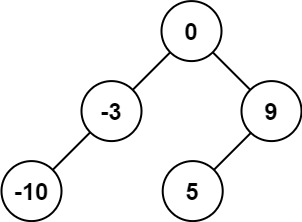

### [108. 将有序数组转换为二叉搜索树](https://leetcode.cn/problems/convert-sorted-array-to-binary-search-tree/)

给你一个整数数组 nums ，其中元素已经按 升序 排列，请你将其转换为一棵 高度平衡 二叉搜索树。

高度平衡 二叉树是一棵满足「每个节点的左右两个子树的高度差的绝对值不超过 1 」的二叉树。


##### 示例 1：

```
输入：nums = [-10,-3,0,5,9]
输出：[0,-3,9,-10,null,5]
```
> 解释：[0,-10,5,null,-3,null,9] 也将被视为正确答案：
> 
> 


##### 示例 2：

```
输入：nums = [1,3]
输出：[3,1]
解释：[1,null,3] 和 [3,1] 都是高度平衡二叉搜索树。
```

##### 提示：
- 1 <= nums.length <= 10<sup>4</sup>
- -10<sup>4</sup> <= nums[i] <= 10<sup>4</sup>
- nums 按 严格递增 顺序排列

##### 题解：
```rust
use std::rc::Rc;
use std::cell::RefCell;
impl Solution {
    pub fn sorted_array_to_bst(nums: Vec<i32>) -> Option<Rc<RefCell<TreeNode>>> {
        Self::helper(&nums, 0, nums.len() - 1)
    }

    fn helper (nums: &Vec<i32>, left: usize, right: usize) -> Option<Rc<RefCell<TreeNode>>> {
        if left > right {
            return None;
        }

        let mid = left + (right - left) / 2;

        let mut root = TreeNode::new(nums[mid]);
        
        if mid - 1 < nums.len() {
            root.left = Self::helper(nums, left, mid - 1);
        }

        root.right = Self::helper(nums, mid + 1, right);

        Some(Rc::new(RefCell::new(root)))
    }
}
```

`递归`
