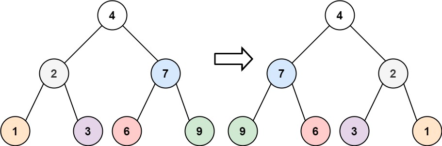
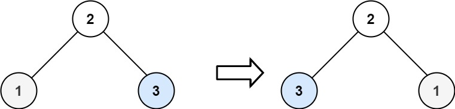

### [226. 翻转二叉树](https://leetcode.cn/problems/invert-binary-tree/)
给你一棵二叉树的根节点 root ，翻转这棵二叉树，并返回其根节点。


##### 示例 1：

```
输入：root = [4,2,7,1,3,6,9]
输出：[4,7,2,9,6,3,1]
```

##### 示例 2：

```
输入：root = [2,1,3]
输出：[2,3,1]
```

##### 示例 3：
```
输入：root = []
输出：[]
```

##### 提示：
- 树中节点数目范围在 [0, 100] 内
- -100 <= Node.val <= 100

##### 题解：
```rust
use std::rc::Rc;
use std::cell::RefCell;
impl Solution {
    pub fn invert_tree(root: Option<Rc<RefCell<TreeNode>>>) -> Option<Rc<RefCell<TreeNode>>> {
        if let Some(node) = &root {
            let mut node = node.borrow_mut();
            let left = node.left.take();
            let right = node.right.take();
            node.right = Self::invert_tree(left);
            node.left = Self::invert_tree(right);
        }
        
        root
    }
}
```
