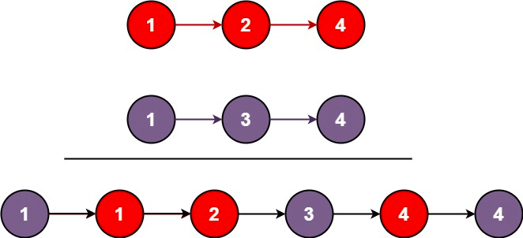

### [21. 合并两个有序链表](https://leetcode.cn/problems/merge-two-sorted-lists/)

将两个升序链表合并为一个新的 升序 链表并返回。新链表是通过拼接给定的两个链表的所有节点组成的。 

##### 示例 1：

```
输入：l1 = [1,2,4], l2 = [1,3,4]
输出：[1,1,2,3,4,4]
```

##### 示例 2：
```
输入：l1 = [], l2 = []
输出：[]
```

##### 示例 3：
```
输入：l1 = [], l2 = [0]
输出：[0]
```

##### 提示：
- 两个链表的节点数目范围是 [0, 50]
- -100 <= Node.val <= 100
- l1 和 l2 均按 非递减顺序 排列

##### 题解：
```rust
impl Solution {
    pub fn merge_two_lists(list1: Option<Box<ListNode>>, list2: Option<Box<ListNode>>) -> Option<Box<ListNode>> {
        match (list1, list2) {
            (Some(mut l1), Some(mut l2)) => {
                if l1.val <= l2.val {
                    l1.next = Self::merge_two_lists(l1.next, Some(l2));
                    Some(l1)
                } else {
                    l2.next = Self::merge_two_lists(Some(l1), l2.next);
                    Some(l2)
                }
            },
            (Some(l1), None) => {
                Some(l1)
            },
            (None, Some(l2)) => {
                Some(l2)
            },
            (None, None) => {
                None
            },
        }
    }
}
```

`递归`
