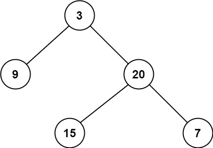

### [111. 二叉树的最小深度](https://leetcode.cn/problems/minimum-depth-of-binary-tree/)
给定一个二叉树，找出其最小深度。

最小深度是从根节点到最近叶子节点的最短路径上的节点数量。

说明：叶子节点是指没有子节点的节点。


##### 示例 1：

```
输入：root = [3,9,20,null,null,15,7]
输出：2
```

##### 示例 2：
```
输入：root = [2,null,3,null,4,null,5,null,6]
输出：5
```

##### 提示：
- 树中节点数的范围在 [ 0, 10<sup>5</sup> ] 内
- -1000 <= Node.val <= 1000

##### 题解：
```rust
use std::rc::Rc;
use std::cell::RefCell;
impl Solution {
    pub fn min_depth(root: Option<Rc<RefCell<TreeNode>>>) -> i32 {
        Self::depth(&root)
    }

    fn depth(root: &Option<Rc<RefCell<TreeNode>>>) -> i32 {
        match root {
            None => 0,
            Some(node) => {
                let node = node.borrow();
                match (&node.left, &node.right) {
                    (None, None) => 1,
                    (Some(_), None) => Self::depth(&node.left) + 1,
                    (None, Some(_)) => Self::depth(&node.right) + 1,
                    (Some(_), Some(_)) => {
                        Self::depth(&node.left).min(Self::depth(&node.right)) + 1
                    }
                }
            }
        }
    }
}
```

`递归`
