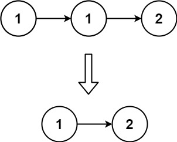
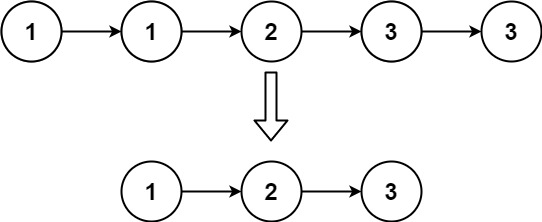

### [83. 删除排序链表中的重复元素](https://leetcode.cn/problems/remove-duplicates-from-sorted-list/)

给定一个已排序的链表的头 head ， 删除所有重复的元素，使每个元素只出现一次 。返回 已排序的链表 。


##### 示例 1：

```
输入：head = [1,1,2]
输出：[1,2]
```

##### 示例 2：

```
输入：head = [1,1,2,3,3]
输出：[1,2,3]
```

##### 提示：
- 链表中节点数目在范围 [0, 300] 内
- -100 <= Node.val <= 100
- 题目数据保证链表已经按升序 排列

##### 题解：
```rust
impl Solution {
    pub fn delete_duplicates(mut head: Option<Box<ListNode>>) -> Option<Box<ListNode>> {
        let mut cur = head.as_mut();

        while let Some(mut node) = cur.take() {
            match node.next {
                Some(ref mut n) => {
                    if n.val == node.val {
                        node.next = n.next.take();
                        cur = Some(node);
                    } else {
                        cur = node.next.as_mut();
                    }
                },
                None => {
                    cur = node.next.as_mut();
                }
            }
        }

        head
    }
}
```

`链表`
