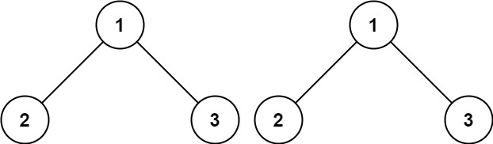
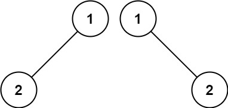
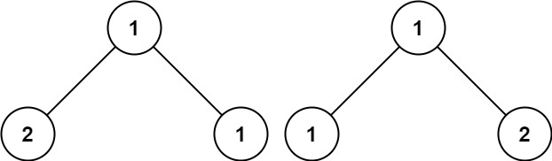

### [100. 相同的树](https://leetcode.cn/problems/same-tree/)

给你两棵二叉树的根节点 p 和 q ，编写一个函数来检验这两棵树是否相同。

如果两个树在结构上相同，并且节点具有相同的值，则认为它们是相同的。


##### 示例 1：

```
输入：p = [1,2,3], q = [1,2,3]
输出：true
```

##### 示例 2：

```
输入：p = [1,2], q = [1,null,2]
输出：false
```

##### 示例 3：

```
输入：p = [1,2,1], q = [1,1,2]
输出：false
```

##### 提示：
- 两棵树上的节点数目都在范围 [0, 100] 内
- -10<sup>4</sup> <= Node.val <= 10<sup>4</sup>


##### 题解：
```rust
use std::rc::Rc;
use std::cell::RefCell;
impl Solution {
    pub fn is_same_tree(p: Option<Rc<RefCell<TreeNode>>>, q: Option<Rc<RefCell<TreeNode>>>) -> bool {
        match (p, q) {
            (None, None) => true,
            (Some(p_node), Some(q_node)) => {
                if p_node.borrow().val != q_node.borrow().val {
                    return false;
                }

                let mut a = p_node.borrow_mut();
                let mut b = q_node.borrow_mut();

                Self::is_same_tree(a.left.take(), b.left.take()) && Self::is_same_tree(a.right.take(), b.right.take())
            },
            _ => false,
        }
    }
}
```

`深度优先搜索`
