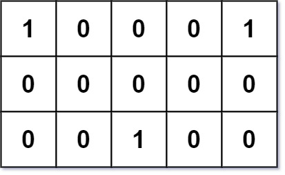

### [296. 最佳的碰头地点](https://leetcode.cn/problems/best-meeting-point/)
给你一个 m x n  的二进制网格 grid ，其中 1 表示某个朋友的家所处的位置。返回 最小的 总行走距离 。

总行走距离 是朋友们家到碰头地点的距离之和。

我们将使用 曼哈顿距离 来计算，其中 distance(p1, p2) = |p2.x - p1.x| + |p2.y - p1.y| 。


##### 示例 1：

```
输入: grid = [[1,0,0,0,1],[0,0,0,0,0],[0,0,1,0,0]]
输出: 6
解释: 给定的三个人分别住在(0,0)，(0,4) 和 (2,2):
(0,2) 是一个最佳的碰面点，其总行走距离为 2 + 2 + 2 = 6，最小，因此返回 6。
```

##### 示例 2:
```
输入: grid = [[1,1]]
输出: 1
```

##### 提示:
- m == grid.length
- n == grid[i].length
- 1 <= m, n <= 200
- grid[i][j] == 0 or 1.
- grid 中 至少 有两个朋友

##### 题解：
```rust
impl Solution {
    pub fn min_total_distance(grid: Vec<Vec<i32>>) -> i32 {
        let n = grid.len();
        let m = grid[0].len();
        let mut rows = vec![];
        let mut cols = vec![];

        for i in 0..n {
            for j in 0..m {
                if grid[i][j] == 1 {
                    rows.push(i as i32);
                    cols.push(j as i32);
                }
            }
        }

        cols.sort();

        Self::min_dist(&rows, rows[rows.len() / 2]) + Self::min_dist(&cols, cols[cols.len() / 2])
    }

    fn min_dist(points: &Vec<i32>, target: i32) -> i32 {
        let mut dist = 0;

        for p in points {
            dist += (p - target).abs();
        }

        dist
    }
}
```
