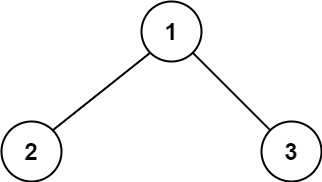
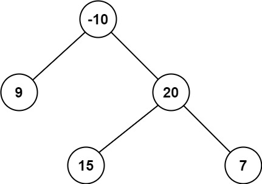

### [124. 二叉树中的最大路径和](https://leetcode.cn/problems/binary-tree-maximum-path-sum/)

路径 被定义为一条从树中任意节点出发，沿父节点-子节点连接，达到任意节点的序列。同一个节点在一条路径序列中 至多出现一次 。该路径 至少包含一个 节点，且不一定经过根节点。

路径和 是路径中各节点值的总和。

给你一个二叉树的根节点 root ，返回其 最大路径和 。


##### 示例 1：

```
输入：root = [1,2,3]
输出：6
解释：最优路径是 2 -> 1 -> 3 ，路径和为 2 + 1 + 3 = 6
```

##### 示例 2：

```
输入：root = [-10,9,20,null,null,15,7]
输出：42
解释：最优路径是 15 -> 20 -> 7 ，路径和为 15 + 20 + 7 = 42
```

##### 提示：
- 树中节点数目范围是 [1, 3 * 10<sup>4</sup>]
- -1000 <= Node.val <= 1000

##### 题解：
```rust
use std::rc::Rc;
use std::cell::RefCell;
impl Solution {
    pub fn max_path_sum(root: Option<Rc<RefCell<TreeNode>>>) -> i32 {
        let mut max_sum = i32::MIN;

        Self::max_gain(&root, &mut max_sum);

        max_sum
    }

    fn max_gain (node: &Option<Rc<RefCell<TreeNode>>>, max_sum: &mut i32) -> i32 {
        if let Some(n) = node {
            let left_gain = 0.max(Self::max_gain(&n.borrow().left, max_sum));
            let right_gain = 0.max(Self::max_gain(&n.borrow().right, max_sum));

            *max_sum = (*max_sum).max(n.borrow().val + left_gain + right_gain);

            n.borrow().val + left_gain.max(right_gain)
        } else {
            0
        }
    }
}
```

`动态规划`
