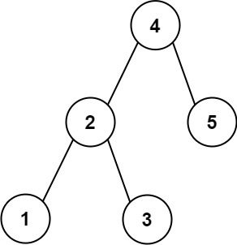

### [272. 最接近的二叉搜索树值 II](https://leetcode.cn/problems/closest-binary-search-tree-value-ii/)
给定二叉搜索树的根 root 、一个目标值 target 和一个整数 k ，返回BST中最接近目标的 k 个值。你可以按 任意顺序 返回答案。

题目 保证 该二叉搜索树中只会存在一种 k 个值集合最接近 target


##### 示例 1：

```
输入: root = [4,2,5,1,3]，目标值 = 3.714286，且 k = 2
输出: [4,3]
```

##### 示例 2:
```
输入: root = [1], target = 0.000000, k = 1
输出: [1]
```

##### 提示：
- 二叉树的节点总数为 n
- 1 <= k <= n <= 10<sup>4</sup>
- 0 <= Node.val <= 10<sup>9</sup>
- -10<sup>9</sup> <= target <= 10<sup>9</sup>


##### 进阶：
- 假设该二叉搜索树是平衡的，请问您是否能在小于 O(n)（ n = total nodes ）的时间复杂度内解决该问题呢？

##### 题解：
```rust
use std::rc::Rc;
use std::cell::RefCell;
use std::collections::VecDeque;
impl Solution {
    pub fn closest_k_values(root: Option<Rc<RefCell<TreeNode>>>, target: f64, k: i32) -> Vec<i32> {
        let mut queue = VecDeque::new();

        Self::inorder(&mut queue, &root, target, k as usize);

        queue.into_iter().collect::<Vec<_>>()
    }

    fn inorder(queue: &mut VecDeque<i32>, root: &Option<Rc<RefCell<TreeNode>>>, target: f64, k: usize) {
        if let Some(r) = root {
            Self::inorder(queue, &r.borrow().left, target, k);

            if queue.len() == k {
                if (*queue.front().unwrap() as f64 - target).abs() > (r.borrow().val as f64 - target).abs() {
                    queue.pop_front();
                    queue.push_back(r.borrow().val);
                } else {
                    return;
                }
            } else {
                queue.push_back(r.borrow().val);
            }

            Self::inorder(queue, &r.borrow().right, target, k);
        }
    }
}
```
