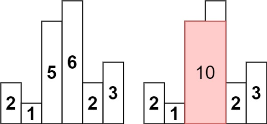

[### 84. 柱状图中最大的矩形](https://leetcode.cn/problems/largest-rectangle-in-histogram/)

给定 n 个非负整数，用来表示柱状图中各个柱子的高度。每个柱子彼此相邻，且宽度为 1 。

求在该柱状图中，能够勾勒出来的矩形的最大面积。

 

##### 示例 1:

```
输入：heights = [2,1,5,6,2,3]
输出：10
解释：最大的矩形为图中红色区域，面积为 10
```

##### 示例 2：

```
输入： heights = [2,4]
输出： 4
```

##### 提示：
- 1 <= heights.length <=10<sup>5</sup>
- 0 <= heights[i] <= 10<sup>4</sup>

##### 题解：
```rust
impl Solution {
    pub fn largest_rectangle_area(heights: Vec<i32>) -> i32 {
        let n = heights.len();
        let mut left = vec![-1;n];
        let mut right = vec![n as i32;n];
        let mut stack = vec![];

        for i in 0..n {
            while stack.len() > 0 && heights[stack[stack.len()-1]] >= heights[i] {
                stack.pop();
            }
            if stack.len() != 0 {
                left[i] = stack[stack.len()-1] as i32;
            }
            stack.push(i);
        }

        stack = vec![];

        for i in (0..n).rev() {
            while stack.len() > 0 && heights[stack[stack.len()-1]] >= heights[i] {
                stack.pop();
            }
            if stack.len() != 0 {
                right[i] = stack[stack.len()-1] as i32;
            }
            stack.push(i);
        }

        let mut ans = 0;

        for i in 0..n {
            ans = ans.max((right[i] - left[i] - 1) * heights[i]);
        }

        ans
    }
}
```

`单调栈`
