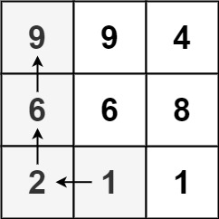
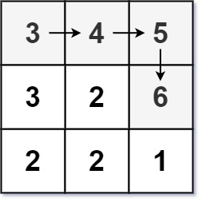

### [329. 矩阵中的最长递增路径](https://leetcode.cn/problems/longest-increasing-path-in-a-matrix/)
给定一个 m x n 整数矩阵 matrix ，找出其中 最长递增路径 的长度。

对于每个单元格，你可以往上，下，左，右四个方向移动。 你 不能 在 对角线 方向上移动或移动到 边界外（即不允许环绕）。


##### 示例 1：

```
输入：matrix = [[9,9,4],[6,6,8],[2,1,1]]
输出：4
解释：最长递增路径为 [1, 2, 6, 9]。
```

##### 示例 2：

```
输入：matrix = [[3,4,5],[3,2,6],[2,2,1]]
输出：4
解释：最长递增路径是 [3, 4, 5, 6]。注意不允许在对角线方向上移动。
```

##### 示例 3：
```
输入：matrix = [[1]]
输出：1
```

##### 提示：
- m == matrix.length
- n == matrix[i].length
- 1 <= m, n <= 200
- 0 <= matrix[i][j] <= 2<sup>31</sup> - 1

##### 题解：
```rust
impl Solution {
    pub fn longest_increasing_path(matrix: Vec<Vec<i32>>) -> i32 {
        let n = matrix.len();
        let m = matrix[0].len();
        let mut visited = vec![vec![0;m];n];
        let mut ans = 0;

        for i in 0..n {
            for j in 0..m {
                ans = ans.max(Self::search(&matrix, &mut visited, i, j));
            }
        }

        ans as i32
    }

    fn search (matrix: &Vec<Vec<i32>>, visited: &mut Vec<Vec<usize>>, i: usize, j: usize) -> usize {
        if visited[i][j] != 0 {
            return visited[i][j];
        }

        let n = matrix.len();
        let m = matrix[0].len();

        visited[i][j] += 1;

        if i > 0 && matrix[i-1][j] > matrix[i][j] {
            visited[i][j] = visited[i][j].max(Self::search(matrix, visited, i-1, j)+1);
        }

        if i < n - 1 && matrix[i+1][j] > matrix[i][j] {
            visited[i][j] = visited[i][j].max(Self::search(matrix, visited, i+1, j)+1);
        }

        if j > 0 && matrix[i][j-1] > matrix[i][j] {
            visited[i][j] = visited[i][j].max(Self::search(matrix, visited, i, j-1)+1);
        }

        if j < m - 1 && matrix[i][j+1] > matrix[i][j] {
            visited[i][j] = visited[i][j].max(Self::search(matrix, visited, i, j+1)+1);
        }
        

         return visited[i][j];
    }
}
```
