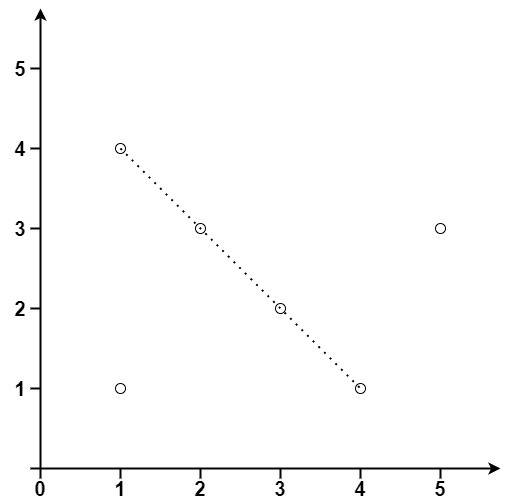

### [149. 直线上最多的点数](https://leetcode.cn/problems/max-points-on-a-line/)

给你一个数组 points ，其中 points[i] = [xi, yi] 表示 X-Y 平面上的一个点。求最多有多少个点在同一条直线上。


##### 示例 1：

```
输入：points = [[1,1],[2,2],[3,3]]
输出：3
```

##### 示例 2：

```
输入：points = [[1,1],[3,2],[5,3],[4,1],[2,3],[1,4]]
输出：4
```

##### 提示：
- 1 <= points.length <= 300
- points[i].length == 2
- -10<sup>4</sup> <= xi, yi <= 10<sup>4</sup>
- points 中的所有点 互不相同

##### 题解：
```rust
impl Solution {
    pub fn max_points(points: Vec<Vec<i32>>) -> i32 {
        let n = points.len();
        let mut ans = 1;

        for i in 0..n {
            let mut mp = std::collections::HashMap::new();
            let mut cnt = 0;

            for j in i+1..n {
                let x0 = points[i][0];
                let x1 = points[i][1];
                let y0 = points[j][0];
                let y1 = points[j][1];
                let a = x0 - y0;
                let b = x1 - y1;
                let k = Self::gcd(a, b);
                *mp.entry((a/k, b/k)).or_insert(0) += 1;
                if let Some(&num) = mp.get(&(a/k, b/k)) {
                    cnt = cnt.max(num);
                }
            }

            ans = ans.max(cnt + 1);
        }

        ans
    }

    fn gcd(a: i32, b: i32) -> i32 {
        if b == 0 {
            a
        } else {
            Self::gcd(b, a % b)
        }
    }
}
```
