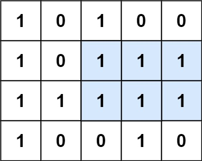

### [85. 最大矩形](https://leetcode.cn/problems/maximal-rectangle/)

给定一个仅包含 0 和 1 、大小为 rows x cols 的二维二进制矩阵，找出只包含 1 的最大矩形，并返回其面积。


##### 示例 1：

```
输入：matrix = [["1","0","1","0","0"],["1","0","1","1","1"],["1","1","1","1","1"],["1","0","0","1","0"]]
输出：6
解释：最大矩形如上图所示。
```

##### 示例 2：
```
输入：matrix = []
输出：0
```

##### 示例 3：
```
输入：matrix = [["0"]]
输出：0
```

##### 示例 4：
```
输入：matrix = [["1"]]
输出：1
```

##### 示例 5：
```
输入：matrix = [["0","0"]]
输出：0
```

##### 提示：
- rows == matrix.length
- cols == matrix[0].length
- 1 <= row, cols <= 200
- matrix[i][j] 为 '0' 或 '1'

##### 题解：
```rust
impl Solution {
    pub fn maximal_rectangle(matrix: Vec<Vec<char>>) -> i32 {
        let Row = matrix.len();

        if Row == 0 {
            return 0;
        }

        let Col = matrix[0].len();
        let mut dp = vec![vec![vec![0;2];Col];Row]; // 记录位置(i,j)的宽/高
        let mut ans = 0;

        for i in 0..Row {
            for j in 0..Col {
                if matrix[i][j] == '1' {
                    dp[i][j][0] = match j { // 记录位置(i,j)的宽
                        0 => 1,
                        _ => dp[i][j-1][0] + 1
                    };
                    dp[i][j][1] = match i { // 记录位置(i,j)的高
                        0 => 1,
                        _ => dp[i-1][j][1] + 1
                    };
                }
            }
        }

        for i in 0..Row {
            for j in 0..Col {
                if matrix[i][j] == '1' {
                    let max_height = dp[i][j][1]; // 位置(i,j)的高
                    let mut width = dp[i][j][0];

                    for k in 1..=max_height { // 按高度枚举 
                        width = width.min(dp[i - k + 1][j][0]); // 每个高度对应的宽度
                        ans = ans.max(width * k); // 每个高度对应的面积
                    }
                }
            }
        }

        ans as i32
    }
}
```

`动态规划`
