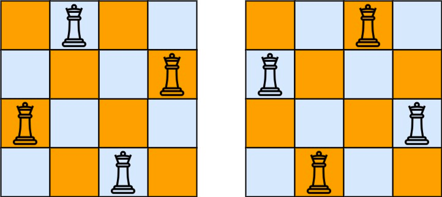

### [52. N皇后 II](https://leetcode.cn/problems/n-queens-ii/)

n 皇后问题 研究的是如何将 n 个皇后放置在 n × n 的棋盘上，并且使皇后彼此之间不能相互攻击。

给你一个整数 n ，返回 n 皇后问题 不同的解决方案的数量。

 

##### 示例 1：

```
输入：n = 4
输出：2
解释：如上图所示，4 皇后问题存在两个不同的解法。
```

##### 示例 2：
```
输入：n = 1
输出：1
```

##### 提示：
- 1 <= n <= 9

##### 题解：
```rust
impl Solution {
    pub fn total_n_queens(n: i32) -> i32 {
        return Self::solve(n, 0, 0, 0, 0);
    }

    fn solve(n: i32, row: i32, cols: i32, left: i32, right: i32) -> i32 {
        if n == row {
            return 1;
        }

        let mut count = 0;
        let mut pos = ((1 << n) - 1) & (!(cols | left | right));

        while pos != 0 {
            let p = pos & (-pos);
            pos = pos & (pos - 1);
            count += Self::solve(n, row + 1, cols | p, (left | p) << 1, (right | p) >> 1);
        }

        count
    }
}
```

`回溯`
