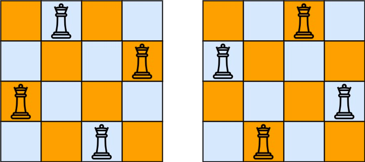

### 51. N 皇后

按照国际象棋的规则，皇后可以攻击与之处在同一行或同一列或同一斜线上的棋子。

n 皇后问题 研究的是如何将 n 个皇后放置在 n×n 的棋盘上，并且使皇后彼此之间不能相互攻击。

给你一个整数 n ，返回所有不同的 n 皇后问题 的解决方案。

每一种解法包含一个不同的 n 皇后问题 的棋子放置方案，该方案中 'Q' 和 '.' 分别代表了皇后和空位。

 

##### 示例 1：

```
输入：n = 4
输出：[[".Q..","...Q","Q...","..Q."],["..Q.","Q...","...Q",".Q.."]]
解释：如上图所示，4 皇后问题存在两个不同的解法。
```

##### 示例 2：
```
输入：n = 1
输出：[["Q"]]
```

##### 提示：
- 1 <= n <= 9

##### 题解：
```rust
impl Solution {
    pub fn solve_n_queens(n: i32) -> Vec<Vec<String>> {
        let mut solutions: Vec<Vec<String>> = Vec::new();
        let mut queens = vec![-1;n as usize];

        Self::solve(&mut solutions, &mut queens, n, 0, 0, 0, 0);

        return solutions;
    }

    fn solve(solutions: &mut Vec<Vec<String>>, queens: &mut Vec<i32>, n: i32, row: i32, cols: i32, left: i32, right: i32) {
        if row == n {
            solutions.push(Self::make_solution(queens, n));
            return;
        }

        let mut positions = ((1 << n) - 1) & (!(cols | left | right));

        while positions != 0 {
            let pos = positions & (-positions);
            positions = positions & (positions - 1);
            let col = Self::count_bits(pos - 1);
            queens[row as usize] = col;
            Self::solve(solutions, queens, n, row + 1, cols | pos, (left | pos) << 1, (right | pos) >> 1);
            queens[row as usize] = -1;
        }
    }

    fn make_solution(queens: &Vec<i32>, n: i32) -> Vec<String> {
        let mut solution = Vec::new();

        for i in 0..n as usize {
            let mut row = vec![".".to_string();n as usize];
            row[queens[i] as usize] = "Q".to_string();
            solution.push(row.join(""));
        }

        solution
    }

    fn count_bits(mut n: i32) -> i32 {
        let mut count = 0;

        while n > 0 {
            n = n & (n - 1);
            count += 1;
        }

        count
    }
}
```

`回溯`
