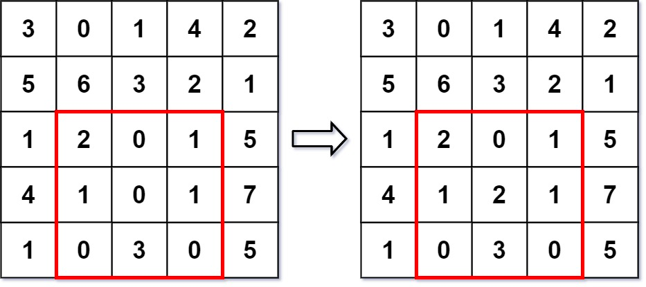

### [308. 二维区域和检索 - 可变](https://leetcode.cn/problems/range-sum-query-2d-mutable/)
给你一个二维矩阵 matrix ，你需要处理下面两种类型的若干次查询：

更新：更新 matrix 中某个单元的值。
求和：计算矩阵 matrix 中某一矩形区域元素的 和 ，该区域由 左上角 (row1, col1) 和 右下角 (row2, col2) 界定。
实现 NumMatrix 类：

NumMatrix(int[][] matrix) 用整数矩阵 matrix 初始化对象。
void update(int row, int col, int val) 更新 matrix[row][col] 的值到 val 。
int sumRegion(int row1, int col1, int row2, int col2) 返回矩阵 matrix 中指定矩形区域元素的 和 ，该区域由 左上角 (row1, col1) 和 右下角 (row2, col2) 界定。


##### 示例 1：

```
输入
["NumMatrix", "sumRegion", "update", "sumRegion"]
[[[[3, 0, 1, 4, 2], [5, 6, 3, 2, 1], [1, 2, 0, 1, 5], [4, 1, 0, 1, 7], [1, 0, 3, 0, 5]]], [2, 1, 4, 3], [3, 2, 2], [2, 1, 4, 3]]
输出
[null, 8, null, 10]

解释
NumMatrix numMatrix = new NumMatrix([[3, 0, 1, 4, 2], [5, 6, 3, 2, 1], [1, 2, 0, 1, 5], [4, 1, 0, 1, 7], [1, 0, 3, 0, 5]]);
numMatrix.sumRegion(2, 1, 4, 3); // 返回 8 (即, 左侧红色矩形的和)
numMatrix.update(3, 2, 2);       // 矩阵从左图变为右图
numMatrix.sumRegion(2, 1, 4, 3); // 返回 10 (即，右侧红色矩形的和)
```

##### 提示：
- m == matrix.length
- n == matrix[i].length
- 1 <= m, n <= 200
- -10<sup>5</sup> <= matrix[i][j] <= 10<sup>5</sup>
- 0 <= row < m
- 0 <= col < n
- -10<sup>5</sup> <= val <= 10<sup>5</sup>
- 0 <= row1 <= row2 < m
- 0 <= col1 <= col2 < n
- 最多调用10<sup>4</sup> 次 sumRegion 和 update 方法

##### 题解：
```rust
struct NumMatrix {
    n: usize,
    m: usize,
    matrix: Vec<Vec<i32>>,
    row_sum: Vec<Vec<i32>>,
}

impl NumMatrix {

    fn new(matrix: Vec<Vec<i32>>) -> Self {
        let n = matrix.len();
        let m = matrix[0].len();
        let mut row_sum = vec![vec![0;m];n];

        for i in 0..n {
            row_sum[i][0] = matrix[i][0];

            for j in 1..m {
                row_sum[i][j] = row_sum[i][j-1] + matrix[i][j];
            }
        }

        Self {
            n,
            m,
            row_sum,
            matrix,
        }
    }
    
    fn update(&mut self, row: i32, col: i32, val: i32) {
        let i = row as usize;
        let j = col as usize;
        self.matrix[i][j] = val;
        let mut k = j;

        if k == 0 {
            self.row_sum[i][j] = self.matrix[i][j];
            k += 1;
        }

        while k < self.m {
            self.row_sum[i][k] = self.row_sum[i][k-1] + self.matrix[i][k];
            k += 1;
        }
    }
    
    fn sum_region(&self, row1: i32, col1: i32, row2: i32, col2: i32) -> i32 {
        let mut ans = 0;
        let row1 = row1 as usize;
        let col1 = col1 as usize;
        let row2 = row2 as usize;
        let col2 = col2 as usize;

        for i in row1..=row2 {
            ans += if col1 == 0 {
                self.row_sum[i][col2]
            } else {
                self.row_sum[i][col2] - self.row_sum[i][col1-1]
            }
        }

        ans
    }
}

```
