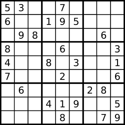
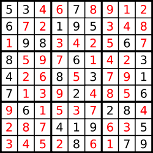

### [37. 解数独](https://leetcode.cn/problems/sudoku-solver/)

编写一个程序，通过填充空格来解决数独问题。

数独的解法需 遵循如下规则：

1. 数字 1-9 在每一行只能出现一次。

2. 数字 1-9 在每一列只能出现一次。

3. 数字 1-9 在每一个以粗实线分隔的 3x3 宫内只能出现一次。（请参考示例图）

数独部分空格内已填入了数字，空白格用 '.' 表示。

##### 示例 1：

```
输入：board = [["5","3",".",".","7",".",".",".","."],["6",".",".","1","9","5",".",".","."],[".","9","8",".",".",".",".","6","."],["8",".",".",".","6",".",".",".","3"],["4",".",".","8",".","3",".",".","1"],["7",".",".",".","2",".",".",".","6"],[".","6",".",".",".",".","2","8","."],[".",".",".","4","1","9",".",".","5"],[".",".",".",".","8",".",".","7","9"]]
输出：[["5","3","4","6","7","8","9","1","2"],["6","7","2","1","9","5","3","4","8"],["1","9","8","3","4","2","5","6","7"],["8","5","9","7","6","1","4","2","3"],["4","2","6","8","5","3","7","9","1"],["7","1","3","9","2","4","8","5","6"],["9","6","1","5","3","7","2","8","4"],["2","8","7","4","1","9","6","3","5"],["3","4","5","2","8","6","1","7","9"]]
```
> 解释：输入的数独如上图所示，唯一有效的解决方案如下所示：
> 
> 

##### 提示：
- board.length == 9
- board[i].length == 9
- board[i][j] 是一位数字或者 '.'
- 题目数据 保证 输入数独仅有一个解

##### 题解：
```rust
use std::collections::HashSet;

impl Solution {
    pub fn solve_sudoku(board: &mut Vec<Vec<char>>) {
        let mut rows = vec![HashSet::new();9];
        let mut cols = vec![HashSet::new();9];
        let mut boxes = vec![HashSet::new();9];
        let mut spaces = vec![];

        for i in 0..9 {
            for j in 0..9 {
                let v = board[i][j];
                if v == '.' {
                    spaces.push((i, j));
                } else {
                    rows[i].insert(v);
                    cols[j].insert(v);
                    boxes[i/3*3+j/3].insert(v);
                }
            }
        }

        Self::dfs(board, &mut rows, &mut cols, &mut boxes, &spaces, 0);
    }

    fn dfs (
        board: &mut Vec<Vec<char>>,
        rows: &mut Vec<HashSet<char>>,
        cols: &mut Vec<HashSet<char>>,
        boxes: &mut Vec<HashSet<char>>,
        spaces: &Vec<(usize, usize)>,
        cur: usize
    ) -> bool {
        if cur == spaces.len() {
            return true;
        }

        let (i, j) = spaces[cur];

        for k in '1'..='9' {
            let u = i/3*3+j/3;

            if !rows[i].contains(&k) && !cols[j].contains(&k) && !boxes[u].contains(&k) {
                rows[i].insert(k);
                cols[j].insert(k);
                boxes[u].insert(k);
                board[i][j] = k;
                if Self::dfs(board, rows, cols, boxes, spaces, cur + 1) {
                    return true;
                } 
                rows[i].remove(&k);
                cols[j].remove(&k);
                boxes[u].remove(&k);
            }
        }

        return false;
    }
}
```

`回溯` `矩阵`
