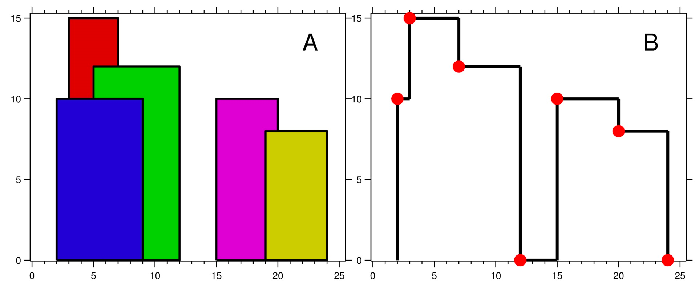

### [218. 天际线问题](https://leetcode.cn/problems/the-skyline-problem/)
城市的 天际线 是从远处观看该城市中所有建筑物形成的轮廓的外部轮廓。给你所有建筑物的位置和高度，请返回 由这些建筑物形成的 天际线 。

每个建筑物的几何信息由数组 buildings 表示，其中三元组 buildings[i] = [lefti, righti, heighti] 表示：

- lefti 是第 i 座建筑物左边缘的 x 坐标。
- righti 是第 i 座建筑物右边缘的 x 坐标。
- heighti 是第 i 座建筑物的高度。

你可以假设所有的建筑都是完美的长方形，在高度为 0 的绝对平坦的表面上。

天际线 应该表示为由 “关键点” 组成的列表，格式 [[x1,y1],[x2,y2],...] ，并按 x 坐标 进行 排序 。关键点是水平线段的左端点。列表中最后一个点是最右侧建筑物的终点，y 坐标始终为 0 ，仅用于标记天际线的终点。此外，任何两个相邻建筑物之间的地面都应被视为天际线轮廓的一部分。

注意：输出天际线中不得有连续的相同高度的水平线。例如 [...[2 3], [4 5], [7 5], [11 5], [12 7]...] 是不正确的答案；三条高度为 5 的线应该在最终输出中合并为一个：[...[2 3], [4 5], [12 7], ...]


##### 示例 1：

```
输入：buildings = [[2,9,10],[3,7,15],[5,12,12],[15,20,10],[19,24,8]]
输出：[[2,10],[3,15],[7,12],[12,0],[15,10],[20,8],[24,0]]
解释：
图 A 显示输入的所有建筑物的位置和高度，
图 B 显示由这些建筑物形成的天际线。图 B 中的红点表示输出列表中的关键点。
```

##### 示例 2：
```
输入：buildings = [[0,2,3],[2,5,3]]
输出：[[0,3],[5,0]]
```

##### 提示：
- 1 <= buildings.length <= 10<sup>4</sup>
- 0 <= lefti < righti <= 2<sup>31</sup> - 1
- 1 <= heighti <= 2<sup>31</sup> - 1
- buildings 按 lefti 非递减排序

##### 题解：
```rust
use std::collections::BinaryHeap;

impl Solution {
    pub fn get_skyline(buildings: Vec<Vec<i32>>) -> Vec<Vec<i32>> {
        let mut points = vec![];

        for building in buildings.iter() {
            points.push((building[0], -building[2]));
            points.push((building[1], building[2]));
        }

        points.sort();

        let mut queue = BinaryHeap::new();
        let mut prev = 0;
        let mut ans = vec![];

        queue.push(prev);

        for point in points.iter() {
            if point.1 < 0 {
                queue.push(-point.1);
            } else {
                let mut tmp = queue.into_vec();
                for index in 0..tmp.len() {
                    if tmp[index] == point.1 {
                        tmp.remove(index);
                        break;
                    }
                }
                queue = tmp.into_iter().collect();
            }

            if let Some(&cur) = queue.peek() {
                if cur != prev {
                    ans.push(vec![point.0, cur]);
                    prev = cur;
                }
            }
        }

        ans
    }
}
```
