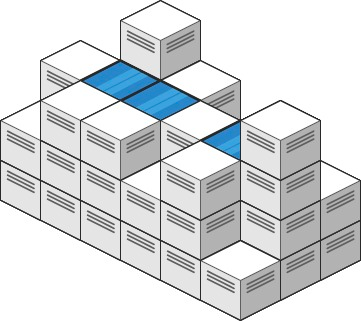
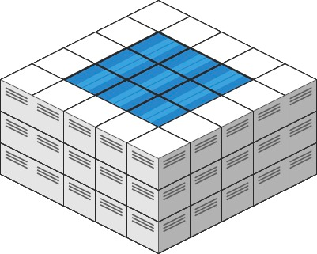

### [407. 接雨水 II](https://leetcode.cn/problems/trapping-rain-water-ii/)
给你一个 m x n 的矩阵，其中的值均为非负整数，代表二维高度图每个单元的高度，请计算图中形状最多能接多少体积的雨水。


##### 示例 1:

```
输入: heightMap = [[1,4,3,1,3,2],[3,2,1,3,2,4],[2,3,3,2,3,1]]
输出: 4
解释: 下雨后，雨水将会被上图蓝色的方块中。总的接雨水量为1+2+1=4。
```

##### 示例 2:

```
输入: heightMap = [[3,3,3,3,3],[3,2,2,2,3],[3,2,1,2,3],[3,2,2,2,3],[3,3,3,3,3]]
输出: 10
```

##### 提示:
- m == heightMap.length
- n == heightMap[i].length
- 1 <= m, n <= 200
- 0 <= heightMap[i][j] <= 2 * 10<sup>4</sup>

##### 题解：
```rust
use std::cmp::Reverse;
use std::collections::BinaryHeap;

impl Solution {
    pub fn trap_rain_water(height_map: Vec<Vec<i32>>) -> i32 {
        let n = height_map.len();
        let m = height_map[0].len();
        let mut queue = BinaryHeap::new();
        let mut vis = vec![vec![false;m];n];

        for i in 0..n {
            for j in 0..m {
                if i == 0 || j == 0 || i == n - 1 || j == m - 1 {
                    vis[i][j] = true;
                    queue.push((Reverse(height_map[i][j]), i, j));
                }
            }
        }

        let mut ans = 0;
        let mut dirs = vec![(1,0),(-1,0),(0,1),(0,-1)];

        while let Some((Reverse(h), i, j)) = queue.pop() {
            for &(dx, dy) in &dirs {
                let x = (i as i32 + dx) as usize;
                let y = (j as i32 + dy) as usize;

                if x < n && y < m && !vis[x][y] {
                    vis[x][y] = true;

                    if h > height_map[x][y] {
                        ans += h - height_map[x][y];
                        queue.push((Reverse(h), x, y));
                    } else {
                        queue.push((Reverse(height_map[x][y]), x, y));
                    }
                }
            }
        }

        ans
    }
}
```
