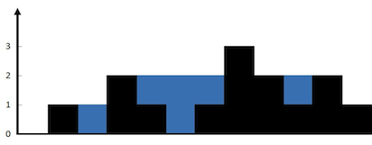

### [42. 接雨水](https://leetcode.cn/problems/trapping-rain-water/)

给定 n 个非负整数表示每个宽度为 1 的柱子的高度图，计算按此排列的柱子，下雨之后能接多少雨水。

##### 示例 1：

```
输入：height = [0,1,0,2,1,0,1,3,2,1,2,1]
输出：6
解释：上面是由数组 [0,1,0,2,1,0,1,3,2,1,2,1] 表示的高度图，在这种情况下，可以接 6 个单位的雨水（蓝色部分表示雨水）。 
```

##### 示例 2：
```
输入：height = [4,2,0,3,2,5]
输出：9
```

##### 提示：
- n == height.length
- 1 <= n <= 2 * 10<sup>4</sup>
- 0 <= height[i] <= 10<sup>5</sup>

##### 题解：
```rust
impl Solution {
    pub fn trap(height: Vec<i32>) -> i32 {
        let n = height.len();
        let mut ans = 0;
        let mut stack: Vec<usize> = vec![];

        for i in 0..n {
            while stack.len() > 0 && height[i] > height[stack[stack.len()-1]] {
                let top = stack.pop().unwrap();

                if stack.len() == 0 {
                    break;
                }

                let left = stack[stack.len() - 1];
                let w = i as i32 - left as i32 - 1;
                let h = height[left].min(height[i]) - height[top];
                ans += w * h;
            }
            
            stack.push(i);
        }

        ans
    }
}
```

`单调栈`
