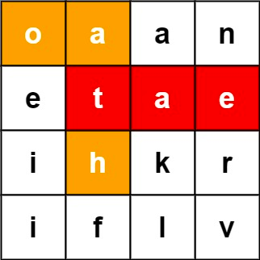
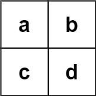

### [212. 单词搜索 II](https://leetcode.cn/problems/word-search-ii/)
给定一个 m x n 二维字符网格 board 和一个单词（字符串）列表 words， 返回所有二维网格上的单词 。

单词必须按照字母顺序，通过 相邻的单元格 内的字母构成，其中“相邻”单元格是那些水平相邻或垂直相邻的单元格。同一个单元格内的字母在一个单词中不允许被重复使用。


##### 示例 1：

```
输入：board = [["o","a","a","n"],["e","t","a","e"],["i","h","k","r"],["i","f","l","v"]], words = ["oath","pea","eat","rain"]
输出：["eat","oath"]
```

##### 示例 2：

```
输入：board = [["a","b"],["c","d"]], words = ["abcb"]
输出：[]
```

##### 提示：
- m == board.length
- n == board[i].length
- 1 <= m, n <= 12
- board[i][j] 是一个小写英文字母
- 1 <= words.length <= 3 * 10<sup>4</sup>
1 <= words[i].length <= 10
- words[i] 由小写英文字母组成
- words 中的所有字符串互不相同

##### 题解：
```rust
use std::collections::HashMap;

impl Solution {
    fn find_words(mut board: Vec<Vec<char>>, words: Vec<String>) -> Vec<String> {
        let mut trie = Box::new(Trie::new());

        for word in words {
            trie.insert(word);
        }

        let n = board.len();
        let m = board[0].len();
        let mut ans = vec![];

        for i in 0..n {
            for j in 0..m {
                Self::dfs( &mut board, &mut ans, &mut trie, i, j);
            }
        }

        ans.into_iter().collect()
    }

    fn dfs(board: &mut Vec<Vec<char>>, ans: &mut Vec<String>, trie: &mut Box<Trie>, i: usize, j: usize) {
        let n = board.len();
        let m = board[0].len();
        let c = board[i][j];
        if let Some(ref mut trie) = trie.children[c as usize - 'a' as usize] {
            board[i][j] = '{';

            if let Some(end) = trie.end.take() {
                ans.push(end);
            }

            if i > 0 {
                Self::dfs(board, ans, trie, i - 1, j);
            }

            if i + 1 < n {
                Self::dfs(board, ans, trie, i + 1, j);
            }

            if j > 0 {
                Self::dfs(board, ans, trie, i, j - 1);
            }

            if j + 1 < m {
                Self::dfs(board, ans, trie, i, j + 1);
            }

            board[i][j] = c;
        }
    }
}

#[derive(Default)]
struct Trie {
    children: [Option<Box<Trie>>;27],
    end: Option<String>,
}

impl Trie {
    fn new() -> Self {
        Default::default()
    }

    fn insert(&mut self, word: String) {
        let mut p = self;

        for &u in word.as_bytes() {
            p = p.children[u as usize - 'a' as usize].get_or_insert_with(|| Box::new(Trie::new()));
        }

        p.end = Some(word);
    }
}
```
