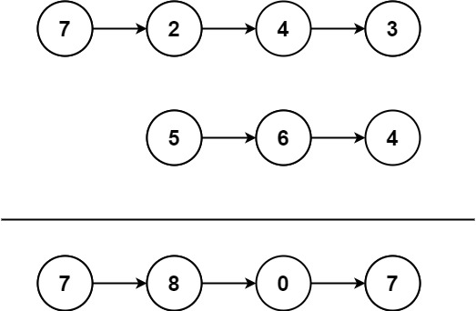

### [445. 两数相加 II](https://leetcode.cn/problems/add-two-numbers-ii/)
给你两个 非空 链表来代表两个非负整数。数字最高位位于链表开始位置。它们的每个节点只存储一位数字。将这两数相加会返回一个新的链表。

你可以假设除了数字 0 之外，这两个数字都不会以零开头。


##### 示例1：

```
输入：l1 = [7,2,4,3], l2 = [5,6,4]
输出：[7,8,0,7]
```

##### 示例2：
```
输入：l1 = [2,4,3], l2 = [5,6,4]
输出：[8,0,7]
```

##### 示例3：
```
输入：l1 = [0], l2 = [0]
输出：[0]
```

##### 提示：
- 链表的长度范围为 [1, 100]
- 0 <= node.val <= 9
- 输入数据保证链表代表的数字无前导 0

##### 题解：
```rust
impl Solution {
    pub fn add_two_numbers(l1: Option<Box<ListNode>>, l2: Option<Box<ListNode>>) -> Option<Box<ListNode>> {
        let mut s1 = vec![];
        let mut s2 = vec![];
        let mut p1 = l1.as_ref();
        let mut p2 = l2.as_ref();

        while let Some(n1) = p1 {
            s1.push(n1);
            p1 = n1.next.as_ref();
        }

        while let Some(n2) = p2 {
            s2.push(n2);
            p2 = n2.next.as_ref();
        }

        let mut ptr = None;
        let mut c = 0;

        while !s1.is_empty() || !s2.is_empty() {
            let v = match (s1.pop(), s2.pop()) {
                (Some(n1), Some(n2)) => n1.val + n2.val + c,
                (Some(n1), None) => n1.val + c,
                (None, Some(n2)) => n2.val + c,
                _ => 0,
            };
            let mut n = Box::new(ListNode::new(v % 10));
            n.next = ptr;
            ptr = Some(n);
            c = v / 10;
        }

        if c != 0 {
            let mut n = Box::new(ListNode::new(c));
            n.next = ptr;
            ptr = Some(n);
        }

        ptr
    }
}
```
