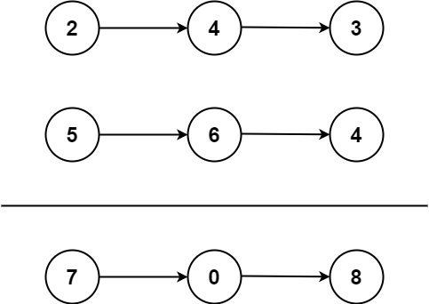

### [2. 两数相加](https://leetcode.cn/problems/add-two-numbers/)

给你两个 非空 的链表，表示两个非负的整数。它们每位数字都是按照 逆序 的方式存储的，并且每个节点只能存储 一位 数字。

请你将两个数相加，并以相同形式返回一个表示和的链表。

你可以假设除了数字 0 之外，这两个数都不会以 0 开头。

##### 示例 1：



```
输入：l1 = [2,4,3], l2 = [5,6,4]
输出：[7,0,8]
解释：342 + 465 = 807.
```

##### 示例 2：
```
输入：l1 = [0], l2 = [0]
输出：[0]
```

##### 示例 3：
```
输入：l1 = [9,9,9,9,9,9,9], l2 = [9,9,9,9]
输出：[8,9,9,9,0,0,0,1]
```

##### 提示：
- 每个链表中的节点数在范围 [1, 100] 内
- 0 <= Node.val <= 9
- 题目数据保证列表表示的数字不含前导零

##### 题解：
```rust
impl Solution {
    pub fn add_two_numbers(mut l1: Option<Box<ListNode>>, l2: Option<Box<ListNode>>) -> Option<Box<ListNode>> {
        let mut p1 = l1;
        let mut p2 = l2;
        let mut dummy = Some(Box::new(ListNode::new(0)));
        let mut p = dummy.as_mut();
        let mut c = 0;

        loop {
            match (p1.take(), p2.take()) {
                (Some(mut n1), Some(mut n2)) => {
                    let v = n1.val + n2.val + c;
                    p.as_mut().unwrap().next = Some(Box::new(ListNode::new(v % 10)));
                    c = v / 10;
                    p1 = n1.next.take();
                    p2 = n2.next.take();
                    p = p.unwrap().next.as_mut();
                },
                (Some(mut n1), None) => {
                    let v = n1.val+ c;
                    p.as_mut().unwrap().next = Some(Box::new(ListNode::new(v % 10)));
                    c = v / 10;
                    p1 = n1.next.take();
                    p = p.unwrap().next.as_mut();
                },
                (None, Some(mut n2)) => {
                    let v = n2.val + c;
                    p.as_mut().unwrap().next = Some(Box::new(ListNode::new(v % 10)));
                    c = v / 10;
                    p2 = n2.next.take();
                    p = p.unwrap().next.as_mut();
                },
                _ => break,
            }
        }

        if c != 0 {
            p.as_mut().unwrap().next = Some(Box::new(ListNode::new(c)));
        }

        dummy.unwrap().next
    }
}
```

```rust
impl Solution {
    pub fn add_two_numbers(l1: Option<Box<ListNode>>, l2: Option<Box<ListNode>>) -> Option<Box<ListNode>> {
        let mut carry = 0;
        let mut head: Box<ListNode> = Box::new(ListNode::new(0));
        let mut p = &mut head;
        let mut n1 = l1;
        let mut n2 = l2;

        while n1.is_some() || n2.is_some() {
            let mut sum: i32 = 0;

            if let Some(v1) = n1 {
                sum = sum + v1.val;
                n1 = v1.next;
            }

            if let Some(v2) = n2 {
                sum = sum + v2.val;
                n2 = v2.next;
            }

            sum = sum + carry;
            carry = sum / 10;

            p.next = Some(Box::new(ListNode::new(sum % 10)));
            p = p.next.as_mut().unwrap();
        }

        if carry > 0 {
            p.next = Some(Box::new(ListNode::new(carry)));
        }

        head.next
    }
}
```

`链表`
