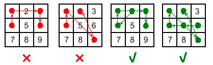

### [351. 安卓系统手势解锁](https://leetcode.cn/problems/android-unlock-patterns/)
我们都知道安卓有个手势解锁的界面，是一个 3 x 3 的点所绘制出来的网格。用户可以设置一个 “解锁模式” ，通过连接特定序列中的点，形成一系列彼此连接的线段，每个线段的端点都是序列中两个连续的点。如果满足以下两个条件，则 k 点序列是有效的解锁模式：

- 解锁模式中的所有点 互不相同 。
- 假如模式中两个连续点的线段需要经过其他点的 中心 ，那么要经过的点 必须提前出现 在序列中（已经经过），不能跨过任何还未被经过的点。
  - 例如，点 5 或 6 没有提前出现的情况下连接点 2 和 9 是有效的，因为从点 2 到点 9 的线没有穿过点 5 或 6 的中心。
  - 然而，点 2 没有提前出现的情况下连接点 1 和 3 是无效的，因为从圆点 1 到圆点 3 的直线穿过圆点 2 的中心。

以下是一些有效和无效解锁模式的示例：


- 无效手势：[4,1,3,6] ，连接点 1 和点 3 时经过了未被连接过的 2 号点。
- 无效手势：[4,1,9,2] ，连接点 1 和点 9 时经过了未被连接过的 5 号点。
- 有效手势：[2,4,1,3,6] ，连接点 1 和点 3 是有效的，因为虽然它经过了点 2 ，但是点 2 在该手势中之前已经被连过了。
- 有效手势：[6,5,4,1,9,2] ，连接点 1 和点 9 是有效的，因为虽然它经过了按键 5 ，但是点 5 在该手势中之前已经被连过了。

给你两个整数，分别为 ​​m 和 n ，那么请返回有多少种 不同且有效的解锁模式 ，是 至少 需要经过 m 个点，但是 不超过 n 个点的。

两个解锁模式 不同 需满足：经过的点不同或者经过点的顺序不同。


##### 示例 1：
```
输入：m = 1, n = 1
输出：9
```

##### 示例 2：
```
输入：m = 1, n = 2
输出：65
```

提示：
- 1 <= m, n <= 9

##### 题解：
```rust
impl Solution {
    pub fn number_of_patterns(m: i32, n: i32) -> i32 {
        let mut ans = 0;
        let mut used = vec![vec![false;3];3];

        Self::dfs(&mut used, &mut ans, m as usize, n as usize, 0, None);

        ans
    }

    fn dfs(used: &mut Vec<Vec<bool>>, ans: &mut i32, m: usize, n: usize, begin: usize, last: Option<(usize, usize)>) {
        if begin >= m {
            *ans += 1;
        }

        if begin == n {
            return;
        }

        if let Some((x, y)) = last {
            for i in 0..3 {
                for j in 0..3 {
                    if !used[i][j] {
                        if ((i == x && j+y == 2) || (j == y && i+x == 2) || (i+x == 2 && j+y == 2)) && !used[(i+x)/2][(j+y)/2] {
                            continue;
                        }

                        used[i][j] = true;
                        Self::dfs(used, ans, m, n, begin + 1, Some((i, j)));
                        used[i][j] = false;
                    }
                }
            }
        } else {
            for i in 0..3 {
                for j in 0..3 {
                    used[i][j] = true;
                    Self::dfs(used, ans, m, n, begin + 1, Some((i, j)));
                    used[i][j] = false;
                }
            }
        }
    }
}
```
