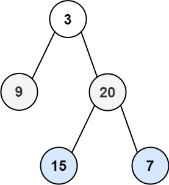

### [102. 二叉树的层序遍历](https://leetcode.cn/problems/binary-tree-level-order-traversal/)

给你二叉树的根节点 root ，返回其节点值的 层序遍历 。 （即逐层地，从左到右访问所有节点）。


##### 示例 1：

```
输入：root = [3,9,20,null,null,15,7]
输出：[[3],[9,20],[15,7]]
```

##### 示例 2：
```
输入：root = [1]
输出：[[1]]
```

##### 示例 3：
```
输入：root = []
输出：[]
```

##### 提示：
- 树中节点数目在范围 [0, 2000] 内
- -1000 <= Node.val <= 1000

##### 题解：
```rust
use std::rc::Rc;
use std::cell::RefCell;
impl Solution {
    pub fn level_order(root: Option<Rc<RefCell<TreeNode>>>) -> Vec<Vec<i32>> {
        let mut ans = vec![];
        let mut queue = vec![];

        if let Some(r) = root {
            queue.push(r);

            while queue.len() > 0 {
                let mut tmp = vec![];
                let mut vals = vec![];

                for i in 0..queue.len() {
                    vals.push(queue[i].borrow().val);

                    if let Some(left) = queue[i].borrow_mut().left.take() {
                        tmp.push(left);
                    }

                    if let Some(right) = queue[i].borrow_mut().right.take() {
                        tmp.push(right);
                    }
                }

                ans.push(vals);
                queue = tmp;
            }
        }

        ans
    }
}
```

`层序遍历`
