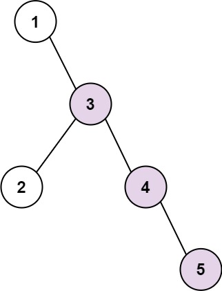
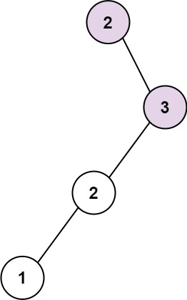

### [298. 二叉树最长连续序列](https://leetcode.cn/problems/binary-tree-longest-consecutive-sequence/)
给你一棵指定的二叉树的根节点 root ，请你计算其中 最长连续序列路径 的长度。

最长连续序列路径 是依次递增 1 的路径。该路径，可以是从某个初始节点到树中任意节点，通过「父 - 子」关系连接而产生的任意路径。且必须从父节点到子节点，反过来是不可以的。


##### 示例 1：

```
输入：root = [1,null,3,2,4,null,null,null,5]
输出：3
解释：当中，最长连续序列是 3-4-5 ，所以返回结果为 3 。
```

##### 示例 2：

```
输入：root = [2,null,3,2,null,1]
输出：2
解释：当中，最长连续序列是 2-3 。注意，不是 3-2-1，所以返回 2 。
```

##### 提示：
- 树中节点的数目在范围 [1, 3 * 10<sup>4</sup>] 内
- -3 * 10<sup>4</sup> <= Node.val <= 3 * 10<sup>4</sup>

##### 题解：
```rust
use std::rc::Rc;
use std::cell::RefCell;
impl Solution {
    pub fn longest_consecutive(root: Option<Rc<RefCell<TreeNode>>>) -> i32 {
        let mut ans = 0;
        let mut queue = vec![];

        if let Some(r) = root {
            queue.push((r, 1));

            while queue.len() > 0 {
                let mut tmp = vec![];

                for i in 0..queue.len() {
                    let (item, cnt) = &queue[i];
                    let val = item.borrow().val;
                    let cnt = *cnt;
                    ans = ans.max(cnt);

                    if let Some(left) = item.borrow_mut().left.take() {
                        if left.borrow().val == val + 1 {
                            tmp.push((left, cnt + 1));
                        } else {
                            tmp.push((left, 1));
                        }
                    }

                    if let Some(right) = item.borrow_mut().right.take() {
                        if right.borrow().val == val + 1 {
                            tmp.push((right, cnt + 1));
                        } else {
                            tmp.push((right, 1));
                        }
                    }
                }

                queue = tmp;
            }
        }

        ans
    }

    
}
```
