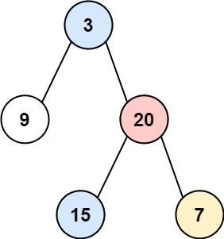
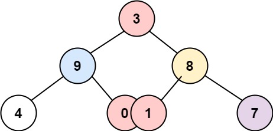
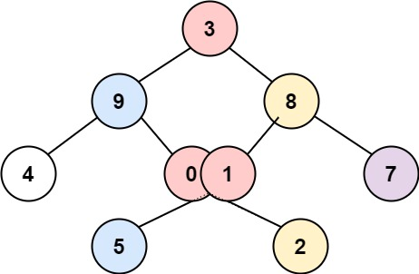

### [314. 二叉树的垂直遍历](https://leetcode.cn/problems/binary-tree-vertical-order-traversal/)
给你一个二叉树的根结点，返回其结点按 垂直方向（从上到下，逐列）遍历的结果。

如果两个结点在同一行和列，那么顺序则为 从左到右。


##### 示例 1：

```
输入：root = [3,9,20,null,null,15,7]
输出：[[9],[3,15],[20],[7]]
```

##### 示例 2：

```
输入：root = [3,9,8,4,0,1,7]
输出：[[4],[9],[3,0,1],[8],[7]]
```

##### 示例 3：

```
输入：root = [3,9,8,4,0,1,7,null,null,null,2,5]
输出：[[4],[9,5],[3,0,1],[8,2],[7]]
```

##### 提示：
- 树中结点的数目在范围 [0, 100] 内
- -100 <= Node.val <= 100

##### 题解：
```rust
use std::rc::Rc;
use std::cell::RefCell;
use std::collections::BTreeMap;
impl Solution {
    pub fn vertical_order(root: Option<Rc<RefCell<TreeNode>>>) -> Vec<Vec<i32>> {
        let mut stack = vec![];

        if let Some(mut r) = root {
            let mut mp = BTreeMap::new();
            let mut tmp = vec![];
            stack.push((r, 0));

            while stack.len() > 0 {
                for i in 0..stack.len() {
                    mp.entry(stack[i].1).or_insert(vec![]).push(stack[i].0.borrow().val);
                    
                    if let Some(left) = stack[i].0.borrow_mut().left.take() {
                        tmp.push((left, stack[i].1 - 1));
                    }

                    if let Some(right) = stack[i].0.borrow_mut().right.take() {
                        tmp.push((right, stack[i].1 + 1));
                    }
                }

                stack = tmp;
                tmp = vec![];
            }

            mp.into_values().collect()
        } else {
            vec![]
        }
    }
}
```
