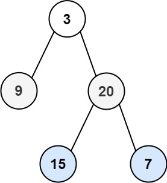

### [103. 二叉树的锯齿形层序遍历](https://leetcode.cn/problems/binary-tree-zigzag-level-order-traversal/)

给你二叉树的根节点 root ，返回其节点值的 锯齿形层序遍历 。（即先从左往右，再从右往左进行下一层遍历，以此类推，层与层之间交替进行）。


##### 示例 1：

```
输入：root = [3,9,20,null,null,15,7]
输出：[[3],[20,9],[15,7]]
```

##### 示例 2：
```
输入：root = [1]
输出：[[1]]
```

##### 示例 3：
```
输入：root = []
输出：[]
```

##### 提示：
- 树中节点数目在范围 [0, 2000] 内
- -100 <= Node.val <= 100

##### 题解：
```rust
use std::rc::Rc;
use std::cell::RefCell;
impl Solution {
    pub fn zigzag_level_order(root: Option<Rc<RefCell<TreeNode>>>) -> Vec<Vec<i32>> {
        let mut reverse = false;
        let mut stack = vec![root];
        let mut ans = vec![];

        while stack.len() > 0 {
            let mut tmp = vec![];
            let mut vals = vec![];

            while let Some(node) = stack.pop() {
                if let Some(n) = node {
                    vals.push(n.borrow().val);

                    if reverse {
                        tmp.push(n.borrow_mut().right.take());
                        tmp.push(n.borrow_mut().left.take());
                    } else {
                        tmp.push(n.borrow_mut().left.take());
                        tmp.push(n.borrow_mut().right.take());
                    }
                }
            }

            ans.push(vals);
            reverse = !reverse;
            stack = tmp;
        }

        ans.pop();
        ans
    }
}
```

`层序遍历`
