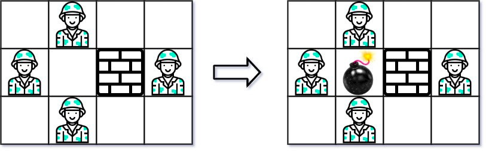
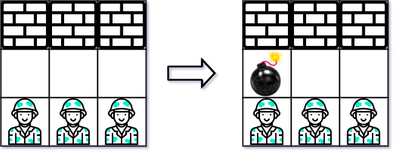

### [361. 轰炸敌人](https://leetcode.cn/problems/bomb-enemy/)
给你一个大小为 m x n 的矩阵 grid ，其中每个单元格都放置有一个字符：

- 'W' 表示一堵墙
- 'E' 表示一个敌人
- '0'（数字 0）表示一个空位

返回你使用 一颗炸弹 可以击杀的最大敌人数目。你只能把炸弹放在一个空位里。

由于炸弹的威力不足以穿透墙体，炸弹只能击杀同一行和同一列没被墙体挡住的敌人。


##### 示例 1：

```
输入：grid = [["0","E","0","0"],["E","0","W","E"],["0","E","0","0"]]
输出：3
```

##### 示例 2：

```
输入：grid = [["W","W","W"],["0","0","0"],["E","E","E"]]
输出：1
```

##### 提示：
- m == grid.length
- n == grid[i].length
- 1 <= m, n <= 500
- grid[i][j] 可以是 'W'、'E' 或 '0'

##### 题解：
```rust
impl Solution {
    pub fn max_killed_enemies(grid: Vec<Vec<char>>) -> i32 {
        let n = grid.len();
        let m = grid[0].len();
        let mut left = vec![vec![0;m];n];
        let mut top = vec![vec![0;m];n];
        let mut bottom = vec![vec![0;m];n];
        let mut right = vec![vec![0;m];n];

        for i in 0..n {
            for j in 0..m {
                match grid[i][j] {
                    'E' => {
                        top[i][j] = if i > 0 { top[i - 1][j] } else { 0 } + 1;
                        left[i][j] = if j > 0 { left[i][j - 1] } else { 0 } + 1;
                    }
                    'W' => {
                        top[i][j] = 0;
                        left[i][j] = 0;
                    }
                    _ => {
                        top[i][j] = if i > 0 { top[i - 1][j] } else { 0 };
                        left[i][j] = if j > 0 { left[i][j - 1] } else { 0 };
                    }
                }
            }
        }

        for i in (0..n).rev() {
            for j in (0..m).rev() {
                match grid[i][j] {
                    'E' => {
                        bottom[i][j] = if i + 1 < n { bottom[i + 1][j] } else { 0 } + 1;
                        right[i][j] = if j + 1 < m { right[i][j + 1] } else { 0 } + 1;
                    }
                    'W' => {
                        bottom[i][j] = 0;
                        right[i][j] = 0;
                    }
                    _ => {
                        bottom[i][j] = if i + 1 < n { bottom[i + 1][j] } else { 0 };
                        right[i][j] = if j + 1 < m { right[i][j + 1] } else { 0 };
                    }
                }
            }
        }

        let mut ans = 0;
        for i in 0..n {
            for j in 0..m {
                if grid[i][j] == '0' {
                    ans = ans.max(top[i][j] + left[i][j] + bottom[i][j] + right[i][j]);
                }
            }
        }
        
        ans
    }
}
```
