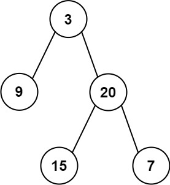

### [106. 从中序与后序遍历序列构造二叉树](https://leetcode.cn/problems/construct-binary-tree-from-inorder-and-postorder-traversal/)

给定两个整数数组 inorder 和 postorder ，其中 inorder 是二叉树的中序遍历， postorder 是同一棵树的后序遍历，请你构造并返回这颗 二叉树 。


##### 示例 1:

```
输入：inorder = [9,3,15,20,7], postorder = [9,15,7,20,3]
输出：[3,9,20,null,null,15,7]
```

##### 示例 2:
```
输入：inorder = [-1], postorder = [-1]
输出：[-1]
```

##### 提示:
- 1 <= inorder.length <= 3000
- postorder.length == inorder.length
- -3000 <= inorder[i], postorder[i] <= 3000
- inorder 和 postorder 都由 不同 的值组成
- postorder 中每一个值都在 inorder 中
- inorder 保证是树的中序遍历
- postorder 保证是树的后序遍历

##### 题解：
```rust
use std::rc::Rc;
use std::cell::RefCell;
impl Solution {
    pub fn build_tree(inorder: Vec<i32>, postorder: Vec<i32>) -> Option<Rc<RefCell<TreeNode>>> {
        if inorder.len() == 0 {
            return None;
        }

        let L = postorder.len();
        let val = postorder[L - 1];
        let index = inorder.iter().position(|&x| x == val).unwrap();

        let mut root = TreeNode::new(val);

        if index > 0 {
            root.left = Self::build_tree(inorder[0..index].to_vec(), postorder[0..index].to_vec());
        }

        if index < L - 1 {
            root.right = Self::build_tree(inorder[index+1..].to_vec(), postorder[index..L-1].to_vec());
        }

        Some(Rc::new(RefCell::new(root)))
    }
}
```

`递归`
