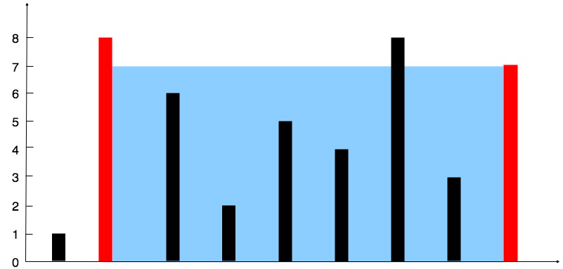

### [11. 盛最多水的容器](https://leetcode.cn/problems/container-with-most-water/)

给定一个长度为 n 的整数数组 height 。有 n 条垂线，第 i 条线的两个端点是 (i, 0) 和 (i, height[i]) 。

找出其中的两条线，使得它们与 x 轴共同构成的容器可以容纳最多的水。

返回容器可以储存的最大水量。

**说明：** 你不能倾斜容器。

##### 示例 1：

```
输入：[1,8,6,2,5,4,8,3,7]
输出：49 
解释：图中垂直线代表输入数组 [1,8,6,2,5,4,8,3,7]。在此情况下，容器能够容纳水（表示为蓝色部分）的最大值为 49。
```

##### 示例 2：
```
输入：height = [1,1]
输出：1
```

##### 提示：
- n == height.length
- 2 <= n <= 10<sup>5</sup>
- 0 <= height[i] <= 10<sup>4</sup>

##### 题解：
```rust
impl Solution {
    pub fn max_area(height: Vec<i32>) -> i32 {
        let n = height.len();
        let mut lo = 0;
        let mut hi = n - 1;
        let mut ans = 0;

        while lo < hi && hi < n {
            ans = ans.max(height[lo].min(height[hi]) * (hi as i32 - lo as i32));

            if height[lo] < height[hi] {
                lo += 1;
            } else {
                hi -= 1;
            }
        }

        ans
    }
}
```

`贪心`  `双指针`
