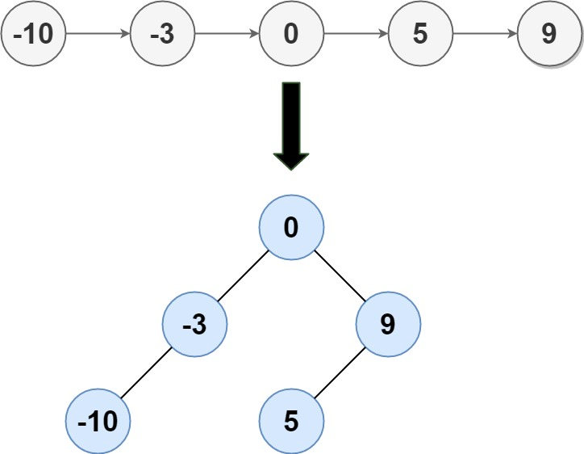

### [109. 有序链表转换二叉搜索树](https://leetcode.cn/problems/convert-sorted-list-to-binary-search-tree/)

给定一个单链表的头节点  head ，其中的元素 按升序排序 ，将其转换为高度平衡的二叉搜索树。

本题中，一个高度平衡二叉树是指一个二叉树每个节点 的左右两个子树的高度差不超过 1。


##### 示例 1:

```
输入: head = [-10,-3,0,5,9]
输出: [0,-3,9,-10,null,5]
解释: 一个可能的答案是[0，-3,9，-10,null,5]，它表示所示的高度平衡的二叉搜索树。
```

##### 示例 2:
```
输入: head = []
输出: []
```

##### 提示:
- head 中的节点数在[ 0, 2 * 10<sup>4</sup> ] 范围内
- -10<sup>5</sup> <= Node.val <= 10<sup>5</sup>

##### 题解：
```rust
use std::rc::Rc;
use std::cell::RefCell;
impl Solution {
    pub fn sorted_list_to_bst(mut head: Option<Box<ListNode>>) -> Option<Rc<RefCell<TreeNode>>> {
        let mut n = 0;
        let mut p = head.as_ref();

        while let Some(h) = p {
            n += 1;
            p = h.next.as_ref();
        }

        Self::construct(&mut head, n)
    }

    fn construct(head: &mut Option<Box<ListNode>>, n: usize) -> Option<Rc<RefCell<TreeNode>>> {
        if n == 0 {
            return None;
        }

        let left = Self::construct(head, n / 2);

        if let Some(h) = head {
            let mut node = TreeNode::new(h.val);
            *head = h.next.take();
            node.left = left;
            node.right = Self::construct(head, n - n / 2 - 1);
            Some(Rc::new(RefCell::new(node)))
        } else {
            None
        }
    }
}
```

`递归`
