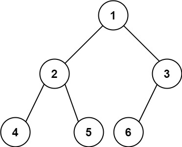

### 222. 完全二叉树的节点个数

给你一棵 完全二叉树 的根节点 root ，求出该树的节点个数。

完全二叉树 的定义如下：在完全二叉树中，除了最底层节点可能没填满外，其余每层节点数都达到最大值，并且最下面一层的节点都集中在该层最左边的若干位置。若最底层为第 h 层，则该层包含 1~ 2h 个节点。


##### 示例 1：

```
输入：root = [1,2,3,4,5,6]
输出：6
```

##### 示例 2：
```
输入：root = []
输出：0
```

##### 示例 3：
```
输入：root = [1]
输出：1
```

##### 提示：
- 树中节点的数目范围是[0, 5 * 10<sup>4</sup>]
- 0 <= Node.val <= 5 * 10<sup>4</sup>
- 题目数据保证输入的树是 完全二叉树


##### 进阶：
- 遍历树来统计节点是一种时间复杂度为 O(n) 的简单解决方案。你可以设计一个更快的算法吗？

##### 题解：
```rust
use std::rc::Rc;
use std::cell::RefCell;
impl Solution {
    pub fn count_nodes(root: Option<Rc<RefCell<TreeNode>>>) -> i32 {
        if let Some(mut r) = root {
            let mut stack = vec![];
            let mut tmp = vec![];
            let mut ans = 0;
            stack.push((r, 0));

            while stack.len() > 0 {
                let n = stack.len();
                for i in 0..n {
                    if let Some(left) = stack[i].0.borrow_mut().left.take() {
                        tmp.push((left, stack[i].1 - 1));
                    }

                    if let Some(right) = stack[i].0.borrow_mut().right.take() {
                        tmp.push((right, stack[i].1 + 1));
                    }
                }

                stack = tmp;
                ans += n;
                tmp = vec![];
            }

            ans as i32
        } else {
            0
        }
    }
}
```
