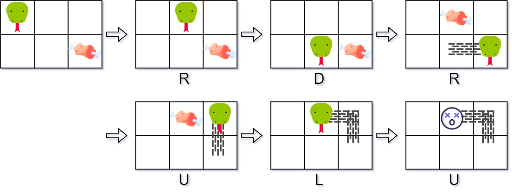

### [353. 贪吃蛇](https://leetcode.cn/problems/design-snake-game/)
请你设计一个 贪吃蛇游戏，该游戏将会在一个 屏幕尺寸 = 宽度 x 高度 的屏幕上运行。如果你不熟悉这个游戏，可以 点击这里 在线试玩。

起初时，蛇在左上角的 (0, 0) 位置，身体长度为 1 个单位。

你将会被给出一个数组形式的食物位置序列 food ，其中 food[i] = (r<sub>i</sub>, c<sub>i</sub>) 。当蛇吃到食物时，身子的长度会增加 1 个单位，得分也会 +1 。

食物不会同时出现，会按列表的顺序逐一显示在屏幕上。比方讲，第一个食物被蛇吃掉后，第二个食物才会出现。

当一个食物在屏幕上出现时，保证 不会 出现在被蛇身体占据的格子里。

如果蛇越界（与边界相撞）或者头与 移动后 的身体相撞（即，身长为 4 的蛇无法与自己相撞），游戏结束。

实现 SnakeGame 类：

- SnakeGame(int width, int height, int[][] food) 初始化对象，屏幕大小为 height x width ，食物位置序列为 food
- int move(String direction) 返回蛇在方向 direction 上移动后的得分。如果游戏结束，返回 -1 。

##### 示例 1：

```
输入：
["SnakeGame", "move", "move", "move", "move", "move", "move"]
[[3, 2, [[1, 2], [0, 1]]], ["R"], ["D"], ["R"], ["U"], ["L"], ["U"]]
输出：
[null, 0, 0, 1, 1, 2, -1]

解释：
SnakeGame snakeGame = new SnakeGame(3, 2, [[1, 2], [0, 1]]);
snakeGame.move("R"); // 返回 0
snakeGame.move("D"); // 返回 0
snakeGame.move("R"); // 返回 1 ，蛇吃掉了第一个食物，同时第二个食物出现在 (0, 1)
snakeGame.move("U"); // 返回 1
snakeGame.move("L"); // 返回 2 ，蛇吃掉了第二个食物，没有出现更多食物
snakeGame.move("U"); // 返回 -1 ，蛇与边界相撞，游戏结束
```

##### 提示：
- 1 <= width, height <= 10<sup>4</sup>
- 1 <= food.length <= 50
- food[i].length == 2
- 0 <= r<sub>i</sub> < height
- 0 <= c<sub>i</sub> < width
- direction.length == 1
- direction is 'U', 'D', 'L', or 'R'.
- 最多调用 104 次 move 方法

##### 题解：
```rust
use std::collections::HashSet;
use std::collections::VecDeque;

struct SnakeGame {
    snake: VecDeque<(i32, i32)>,
    food: Vec<(i32, i32)>,
    screen: HashSet<(i32, i32)>,
    height: i32,
    width: i32,
    score: i32,
}

impl SnakeGame {
    fn new(width: i32, height: i32, food: Vec<Vec<i32>>) -> Self {
        let mut snake = VecDeque::new();
        snake.push_back((0, 0));
        let mut screen = HashSet::new();
        screen.insert((0, 0));

        SnakeGame {
            snake,
            food: food.iter().rev().map(|v| (v[0], v[1])).collect(),
            screen,
            height,
            width,
            score: 0,
        }
    }

    fn make_a_move(&mut self, direction: String) -> i32 {
        if self.score == -1 {
            return -1;
        }

        let head = self.snake.front().unwrap();
        let offset = match direction.as_str() {
            "U" => (-1, 0),
            "L" => (0, -1),
            "R" => (0, 1),
            "D" => (1, 0),
            _ => (0, 0),
        };
        let next = (head.0 + offset.0, head.1 + offset.1);
        let tail = self.snake.pop_back().unwrap();

        self.screen.remove(&tail);

        if next.0 < 0 || next.0 >= self.height || next.1 < 0 || next.1 >= self.width || self.screen.contains(&next) {
            return -1;
        }

        self.snake.push_front(next);
        self.screen.insert(next);

        if let Some(&food) = self.food.last() {
            if food == next {
                self.food.pop();
                self.score += 1;
                self.screen.insert(tail);
                self.snake.push_back(tail);
            }
        }

        self.score
    }
}

```
