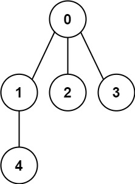
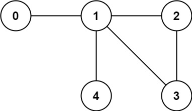

### [261. 以图判树](https://leetcode.cn/problems/graph-valid-tree/)
给定编号从 0 到 n - 1 的 n 个结点。给定一个整数 n 和一个 edges 列表，其中 edges[i] = [ai, bi] 表示图中节点 ai 和 bi 之间存在一条无向边。

如果这些边能够形成一个合法有效的树结构，则返回 true ，否则返回 false 。


##### 示例 1：

```
输入: n = 5, edges = [[0,1],[0,2],[0,3],[1,4]]
输出: true
```

##### 示例 2:

```
输入: n = 5, edges = [[0,1],[1,2],[2,3],[1,3],[1,4]]
输出: false
```

##### 提示：
- 1 <= n <= 2000
- 0 <= edges.length <= 5000
- edges[i].length == 2
- 0 <= a<sub>i</sub>, b<sub>i</sub> < n
- a<sub>i</sub> != b<sub>i</sub>
- 不存在自循环或重复的边

##### 题解：
```rust
impl Solution {
    pub fn valid_tree(n: i32, edges: Vec<Vec<i32>>) -> bool {
        let n = n as usize;
        let mut un = UnionFind::new(n);

        for edge in edges {
            if !un.union(edge[0] as usize, edge[1] as usize) {
                return false;
            }
        }

        un.cnt == 1
    }
}

struct UnionFind {
    parents: Vec<usize>,
    cnt: usize,
}

impl UnionFind {
    fn new(n: usize) -> Self {
        Self {
            parents: (0..n).collect(),
            cnt: n,
        }
    }

    fn find(&mut self, x: usize) -> usize {
        if x != self.parents[x] {
            self.parents[x] = self.find(self.parents[x]);
        }

        self.parents[x]
    }

    fn union(&mut self, x: usize, y: usize) -> bool {
        let a = self.find(x);
        let b = self.find(y);

        if a != b {
            self.parents[a] = b;
            self.cnt -= 1;
            true
        } else {
            false
        }
    }
}
```
