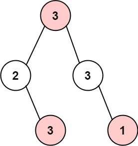

### [337. 打家劫舍 III](https://leetcode.cn/problems/house-robber-iii/)
小偷又发现了一个新的可行窃的地区。这个地区只有一个入口，我们称之为 root 。

除了 root 之外，每栋房子有且只有一个“父“房子与之相连。一番侦察之后，聪明的小偷意识到“这个地方的所有房屋的排列类似于一棵二叉树”。 如果 两个直接相连的房子在同一天晚上被打劫 ，房屋将自动报警。

给定二叉树的 root 。返回 在不触动警报的情况下 ，小偷能够盗取的最高金额 。


##### 示例 1:

```
输入: root = [3,2,3,null,3,null,1]
输出: 7
解释: 小偷一晚能够盗取的最高金额 3 + 3 + 1 = 7
```

##### 示例 2:

```
输入: root = [3,4,5,1,3,null,1]
输出: 9
解释: 小偷一晚能够盗取的最高金额 4 + 5 = 9
```

##### 提示：
- 树的节点数在 [1, 10<sup>4</sup>] 范围内
- 0 <= Node.val <= 10<sup>4</sup>

##### 题解：
```rust
use std::rc::Rc;
use std::cell::RefCell;
impl Solution {
    pub fn rob(root: Option<Rc<RefCell<TreeNode>>>) -> i32 {
        let (selected, skipped) = Self::dfs(&root);

        selected.max(skipped)
    }

    fn dfs(root: &Option<Rc<RefCell<TreeNode>>>) -> (i32, i32) {
        if let Some(r) = root {
            let (left_selected, left_skipped) = Self::dfs(&r.borrow().left);
            let (right_selected, right_skipped) = Self::dfs(&r.borrow().right);

            let selected = r.borrow().val + left_skipped + right_skipped;
            let skipped = left_selected.max(left_skipped) + right_selected.max(right_skipped);

            (selected, skipped)
        } else {
            (0, 0)
        }
    }
}
```
