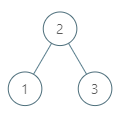
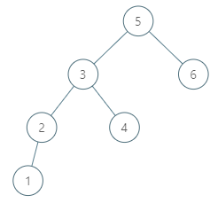

### [285. 二叉搜索树中的中序后继](https://leetcode.cn/problems/inorder-successor-in-bst/)
给定一棵二叉搜索树和其中的一个节点 p ，找到该节点在树中的中序后继。如果节点没有中序后继，请返回 null 。

节点 p 的后继是值比 p.val 大的节点中键值最小的节点。


##### 示例 1：


```
输入：root = [2,1,3], p = 1
输出：2
解释：这里 1 的中序后继是 2。请注意 p 和返回值都应是 TreeNode 类型。
```

##### 示例 2：


```
输入：root = [5,3,6,2,4,null,null,1], p = 6
输出：null
解释：因为给出的节点没有中序后继，所以答案就返回 null 了。
```

##### 提示：
- 树中节点的数目在范围 [1, 10<sup>4</sup>] 内。
- -10<sup>5</sup> <= Node.val <= 10<sup>5</sup>
- 树中各节点的值均保证唯一。

##### 题解：
```rust
use std::rc::Rc;
use std::cell::RefCell;
impl Solution {
    pub fn inorder_successor(root: Option<Rc<RefCell<TreeNode>>>, p: Option<Rc<RefCell<TreeNode>>>) -> Option<Rc<RefCell<TreeNode>>> {
        let mut stack = vec![];
        let mut node = root;
        let mut prev: Option<Rc<RefCell<TreeNode>>> = None;

        while stack.len() > 0 || node.is_some() {
            while let Some(n) = node  {
                node = n.borrow_mut().left.take();
                stack.push(n);
            }

            if let Some(n) = stack.pop() {
                node = n.borrow_mut().right.take();

                if p == prev {
                    return Some(n);
                }

                prev = Some(n);
            }
        }

        None
    }
}
```
