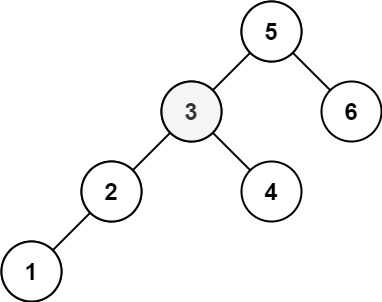

### [230. 二叉搜索树中第K小的元素](https://leetcode.cn/problems/kth-smallest-element-in-a-bst/)
给定一个二叉搜索树的根节点 root ，和一个整数 k ，请你设计一个算法查找其中第 k 个最小元素（从 1 开始计数）。


##### 示例 1：

```
输入：root = [3,1,4,null,2], k = 1
输出：1
```

##### 示例 2：

```
输入：root = [5,3,6,2,4,null,null,1], k = 3
输出：3
```


##### 提示：
- 树中的节点数为 n 。
- 1 <= k <= n <= 10<sup>4</sup>
- 0 <= Node.val <= 10<sup>4</sup>

##### 题解：
```rust
use std::rc::Rc;
use std::cell::RefCell;
impl Solution {
    pub fn kth_smallest(root: Option<Rc<RefCell<TreeNode>>>, k: i32) -> i32 {
        let mut k = k;
        let mut node = root;
        let mut stack = vec![];

        while node.is_some() || stack.len() > 0 {
            while let Some(mut n) = node {
                node = n.borrow_mut().left.take();
                stack.push(n);
            }

            if let Some(n) = stack.pop() {
                k -= 1;

                if k == 0 {
                    node = Some(n);
                    break;
                }

                node = n.borrow_mut().right.take();
            }
        }

        if let Some(n) = node {
            n.borrow().val
        } else {
            -1
        }
    }
}
```
