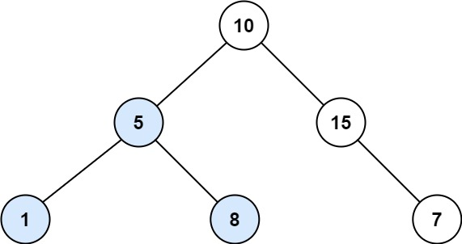

### [333. 最大 BST 子树](https://leetcode.cn/problems/largest-bst-subtree/)
给定一个二叉树，找到其中最大的二叉搜索树（BST）子树，并返回该子树的大小。其中，最大指的是子树节点数最多的。

二叉搜索树（BST）中的所有节点都具备以下属性：

- 左子树的值小于其父（根）节点的值。

- 右子树的值大于其父（根）节点的值。

注意：子树必须包含其所有后代。


##### 示例 1：

```
输入：root = [10,5,15,1,8,null,7]
输出：3
解释：本例中最大的 BST 子树是高亮显示的子树。返回值是子树的大小，即 3 。
```

##### 示例 2：
```
输入：root = [4,2,7,2,3,5,null,2,null,null,null,null,null,1]
输出：2
```

##### 提示：
- 树上节点数目的范围是 [0, 10<sup>4</sup>]
- -10<sup>4</sup> <= Node.val <= 10<sup>4</sup>


##### 进阶:  
- 你能想出 O(n) 时间复杂度的解法吗？

##### 题解：
```rust
use std::rc::Rc;
use std::cell::RefCell;
impl Solution {
    pub fn largest_bst_subtree(root: Option<Rc<RefCell<TreeNode>>>) -> i32 {
        let mut ans = 0;
        Self::post_order(&root, &mut ans);
        ans
    }

    fn post_order(root: &Option<Rc<RefCell<TreeNode>>>, ans: &mut i32) -> Option<(i32, i32, i32)> {
        if let Some(r) = root {
            let mut cnt = 1;
            let mut min = r.borrow().val;
            let mut max = r.borrow().val;

            let left = Self::post_order(&r.borrow().left, ans);
            let right = Self::post_order(&r.borrow().right, ans);

            if let Some(left) = left {
                if left.2 < r.borrow().val {
                    cnt += left.0;
                    min = min.min(left.1);
                } else {
                    return None;
                }
            } else {
                return None;
            }

            if let Some(right) = right {
                if r.borrow().val < right.1 {
                    cnt += right.0;
                    max = max.max(right.2);
                } else {
                    return None;
                }
            } else {
                return None;
            }

            *ans = cnt.max(*ans);

            Some((cnt, min, max))
        } else {
            Some((0, i32::MAX, i32::MIN))
        }
    }
}
```
