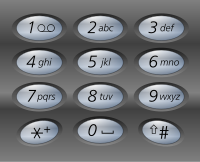

### [17. 电话号码的字母组合](https://leetcode.cn/problems/letter-combinations-of-a-phone-number/)

给定一个仅包含数字 2-9 的字符串，返回所有它能表示的字母组合。答案可以按 任意顺序 返回。

给出数字到字母的映射如下（与电话按键相同）。注意 1 不对应任何字母。



##### 示例 1：
```
输入：digits = "23"
输出：["ad","ae","af","bd","be","bf","cd","ce","cf"]
```

##### 示例 2：
```
输入：digits = ""
输出：[]
```

##### 示例 3：
```
输入：digits = "2"
输出：["a","b","c"]
```

##### 提示：
- 0 <= digits.length <= 4
- digits[i] 是范围 ['2', '9'] 的一个数字。

##### 题解：
```rust
impl Solution {
    pub fn letter_combinations(digits: String) -> Vec<String> {
        let mut ans = vec![];

        if digits.len() == 0 {
            return ans;
        }

        Self::dfs(digits.as_bytes(), &mut ans, &mut String::new(), 0);

        ans
    }

    fn dfs(ss: &[u8], ans: &mut Vec<String>, selected: &mut String, begin: usize) {
        if begin == ss.len() {
            ans.push(selected.to_string());
            return;
        }

        let letters = Self::get_letters(ss[begin]);

        for &letter in letters.iter() {
            selected.push(letter);
            Self::dfs(ss, ans, selected, begin + 1);
            selected.pop();
        }
    }

    fn get_letters(num: u8) -> Vec<char> {
		match num {
			b'2' => vec!['a', 'b', 'c'],
			b'3' => vec!['d', 'e', 'f'],
			b'4' => vec!['g', 'h', 'i'],
			b'5' => vec!['j', 'k', 'l'],
			b'6' => vec!['m', 'n', 'o'],
			b'7' => vec!['p', 'q', 'r', 's'],
			b'8' => vec!['t', 'u', 'v'],
			b'9' => vec!['w', 'x', 'y', 'z'],
			_ => vec![],
		}
    }
}
```

`回溯`
