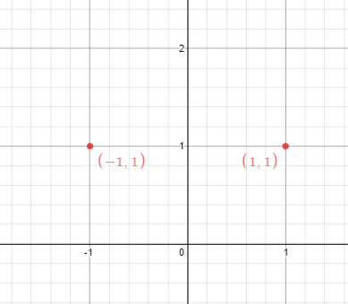
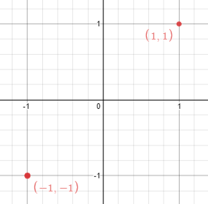

### [356. 直线镜像](https://leetcode.cn/problems/line-reflection/)
在一个二维平面空间中，给你 n 个点的坐标。问，是否能找出一条平行于 y 轴的直线，让这些点关于这条直线成镜像排布？

注意：题目数据中可能有重复的点。


##### 示例 1：

```
输入：points = [[1,1],[-1,1]]
输出：true
解释：可以找出 x = 0 这条线。
```

##### 示例 2：

```
输入：points = [[1,1],[-1,-1]]
输出：false
解释：无法找出这样一条线。
```

##### 提示：
- n == points.length
- 1 <= n <= 10<sup>4</sup>
- -10<sup>8</sup> <= points[i][j] <= 10<sup>8</sup>

##### 题解：
```rust
impl Solution {
    pub fn is_reflected(points: Vec<Vec<i32>>) -> bool {
        let mut left = i32::MAX;
        let mut right = i32::MIN;
        let mut dup = std::collections::HashSet::new();

        for point in points.iter() {
            left = left.min(point[0]);
            right = right.max(point[0]);
            dup.insert((point[0], point[1]));
        }

        let s = left + right;

        for point in points.iter() {
            if !dup.contains(&(s-point[0], point[1])) {
                return false;
            }
        }

        true
    }
}
```
