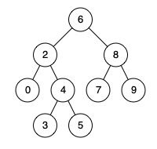

### [235. 二叉搜索树的最近公共祖先](https://leetcode.cn/problems/lowest-common-ancestor-of-a-binary-search-tree/)
给定一个二叉搜索树, 找到该树中两个指定节点的最近公共祖先。

百度百科中最近公共祖先的定义为：“对于有根树 T 的两个结点 p、q，最近公共祖先表示为一个结点 x，满足 x 是 p、q 的祖先且 x 的深度尽可能大（一个节点也可以是它自己的祖先）。”

例如，给定如下二叉搜索树:  root = [6,2,8,0,4,7,9,null,null,3,5]





##### 示例 1:
```
输入: root = [6,2,8,0,4,7,9,null,null,3,5], p = 2, q = 8
输出: 6
解释: 节点 2 和节点 8 的最近公共祖先是 6。
```

##### 示例 2:
```
输入: root = [6,2,8,0,4,7,9,null,null,3,5], p = 2, q = 4
输出: 2
解释: 节点 2 和节点 4 的最近公共祖先是 2, 因为根据定义最近公共祖先节点可以为节点本身。
```

##### 说明:
- 所有节点的值都是唯一的。
- p、q 为不同节点且均存在于给定的二叉搜索树中。

##### 题解：
```rust
use std::rc::Rc;
use std::cell::RefCell;
impl Solution {
    pub fn lowest_common_ancestor(mut root: Option<Rc<RefCell<TreeNode>>>, p: Option<Rc<RefCell<TreeNode>>>, q: Option<Rc<RefCell<TreeNode>>>) -> Option<Rc<RefCell<TreeNode>>> {
        match (p, q) {
            (Some(p), Some(q)) => {
                while let Some(r) = root {
                    if r.borrow().val > p.borrow().val && r.borrow().val > q.borrow().val {
                        root = r.borrow_mut().left.take();
                    } else if r.borrow().val < p.borrow().val && r.borrow().val < q.borrow().val {
                        root = r.borrow_mut().right.take();
                    } else {
                        return Some(r);
                    }
                }

                None
            },
            _ => None,
        }
    }
}
```
