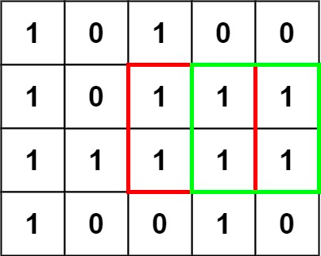
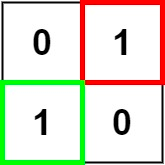

### [221. 最大正方形](https://leetcode.cn/problems/maximal-square/)
在一个由 '0' 和 '1' 组成的二维矩阵内，找到只包含 '1' 的最大正方形，并返回其面积。


##### 示例 1：

```
输入：matrix = [["1","0","1","0","0"],["1","0","1","1","1"],["1","1","1","1","1"],["1","0","0","1","0"]]
输出：4
```

##### 示例 2：

```
输入：matrix = [["0","1"],["1","0"]]
输出：1
```

##### 示例 3：
```
输入：matrix = [["0"]]
输出：0
```

##### 提示：
- m == matrix.length
- n == matrix[i].length
- 1 <= m, n <= 300
- matrix[i][j] 为 '0' 或 '1'

##### 题解：
```rust
impl Solution {
    pub fn maximal_square(matrix: Vec<Vec<char>>) -> i32 {
        let n = matrix.len();
        let m = matrix[0].len();
        let mut dp = vec![vec![0;m];n];
        let mut ans = 0;

        for i in 0..n {
            for j in 0..m {
                if matrix[i][j] == '1' {
                    if i == 0 || j == 0 {
                        dp[i][j] = 1;
                    } else {
                        dp[i][j] = dp[i-1][j].min(dp[i][j-1]).min(dp[i-1][j-1]) + 1;
                    }
                    ans = ans.max(dp[i][j]);
                }
            }
        }

        ans * ans
    }
}
```
