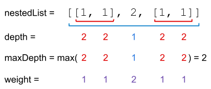
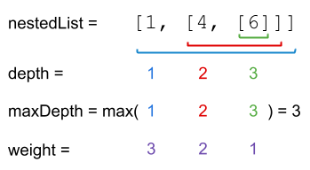

### [364. 加权嵌套序列和 II](https://leetcode.cn/problems/nested-list-weight-sum-ii/)
给你一个整数嵌套列表 nestedList ，每一个元素要么是一个整数，要么是一个列表（这个列表中的每个元素也同样是整数或列表）。

整数的 深度 取决于它位于多少个列表内部。例如，嵌套列表 [1,[2,2],[[3],2],1] 的每个整数的值都等于它的 深度 。令 maxDepth 是任意整数的 最大深度 。

整数的 权重 为 maxDepth - (整数的深度) + 1 。

将 nestedList 列表中每个整数先乘权重再求和，返回该加权和。


##### 示例 1：

```
输入：nestedList = [[1,1],2,[1,1]]
输出：8
解释：4 个 1 在深度为 1 的位置， 一个 2 在深度为 2 的位置。
1*1 + 1*1 + 2*2 + 1*1 + 1*1 = 8
```

##### 示例 2：

```
输入：nestedList = [1,[4,[6]]]
输出：17
解释：一个 1 在深度为 3 的位置， 一个 4 在深度为 2 的位置，一个 6 在深度为 1 的位置。
1*3 + 4*2 + 6*1 = 17
```

##### 提示：
- 1 <= nestedList.length <= 50
- 嵌套列表中整数的值在范围 [-100, 100]
- 任意整数的最大 深度 小于等于 50

##### 题解：
```rust
impl Solution {
    pub fn depth_sum_inverse(nested_list: Vec<NestedInteger>) -> i32 {
        let mut vec = vec![];
        let mut max_depth = 1;
        Self::depth_sum(&nested_list, 1, &mut max_depth, &mut vec);

        vec.iter().fold(0, |acc, (d, v)| acc + (max_depth - d + 1) * v)
    }

    fn depth_sum(nested_list: &Vec<NestedInteger>, depth: i32, max_depth: &mut i32, vec: &mut Vec<(i32, i32)>) {
        for list in nested_list {
            *max_depth = (*max_depth).max(depth);
            match list {
                NestedInteger::Int(v) => {
                    vec.push((depth, *v));
                },
                NestedInteger::List(sub) => Self::depth_sum(sub, depth + 1, max_depth, vec)
            }
        }
    }
}

```
