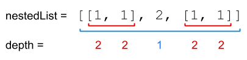
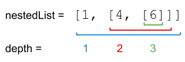

### [339. 嵌套列表权重和](https://leetcode.cn/problems/nested-list-weight-sum/)
给定一个嵌套的整数列表 nestedList ，每个元素要么是整数，要么是列表。同时，列表中元素同样也可以是整数或者是另一个列表。

整数的 深度 是其在列表内部的嵌套层数。例如，嵌套列表 [1,[2,2],[[3],2],1] 中每个整数的值就是其深度。

请返回该列表按深度加权后所有整数的总和。


##### 示例 1：

```
输入：nestedList = [[1,1],2,[1,1]]
输出：10
解释：因为列表中有四个深度为 2 的 1 ，和一个深度为 1 的 2。
```

##### 示例 2：

```
输入：nestedList = [1,[4,[6]]]
输出：27
解释：一个深度为 1 的 1，一个深度为 2 的 4，一个深度为 3 的 6。所以，1 + 4*2 + 6*3 = 27。
```

##### 示例 3：
```
输入：nestedList = [0]
输出：0
```

##### 提示：
- 1 <= nestedList.length <= 50
- 嵌套列表中整数的值在范围 [-100, 100] 内
- 任何整数的最大 深度 都小于或等于 50

##### 题解：
```rust
impl Solution {
    pub fn depth_sum(nested_list: Vec<NestedInteger>) -> i32 {
        Self::weights(&nested_list, 1)
    }

    fn weights(nested_list: &Vec<NestedInteger>, depth: i32) -> i32 {
        let mut sum = 0;

        for list in nested_list {
            match list {
                NestedInteger::Int(v) => sum += depth * v,
                NestedInteger::List(nested) => sum += Self::weights(nested, depth + 1)
            }
        }

        sum
    }
}
```
