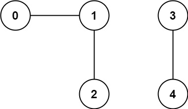
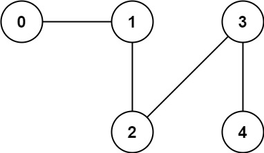

### [323. 无向图中连通分量的数目](https://leetcode.cn/problems/number-of-connected-components-in-an-undirected-graph/)
你有一个包含 n 个节点的图。给定一个整数 n 和一个数组 edges ，其中 edges[i] = [a<sub>i</sub>, b<sub>i</sub>] 表示图中 a<sub>i</sub> 和 b<sub>i</sub> 之间有一条边。

返回 图中已连接分量的数目 。


##### 示例 1:

```
输入: n = 5, edges = [[0, 1], [1, 2], [3, 4]]
输出: 2
```

##### 示例 2:

```
输入: n = 5, edges = [[0,1], [1,2], [2,3], [3,4]]
输出:  1
```

##### 提示：
- 1 <= n <= 2000
- 1 <= edges.length <= 5000
- edges[i].length == 2
- 0 <= a<sub>i</sub> <= b<sub>i</sub> < n
- a<sub>i</sub> != b<sub>i</sub>
- edges 中不会出现重复的边

##### 题解：
```rust
impl Solution {
    fn count_components(n: i32, edges: Vec<Vec<i32>>) -> i32 {
        let mut uf = UnionFind::new(n as usize);

        for edge in edges {
            uf.union(edge[0] as usize, edge[1] as usize);
        }

        uf.cnt as i32
    }
}

struct UnionFind {
    parents: Vec<usize>,
    cnt: usize,
}

impl UnionFind {
    fn new(n: usize) -> Self {
        Self {
            parents: (0..n).collect(),
            cnt: n,
        }
    }

    fn find(&mut self, x: usize) -> usize {
        if x != self.parents[x] {
            self.parents[x] = self.find(self.parents[x]);
        }

        self.parents[x]
    }

    fn union(&mut self, x: usize, y: usize) {
        let a = self.find(x);
        let b = self.find(y);

        if a != b {
            self.parents[a] = b;
            self.cnt -= 1;
        }
    }
}
```
